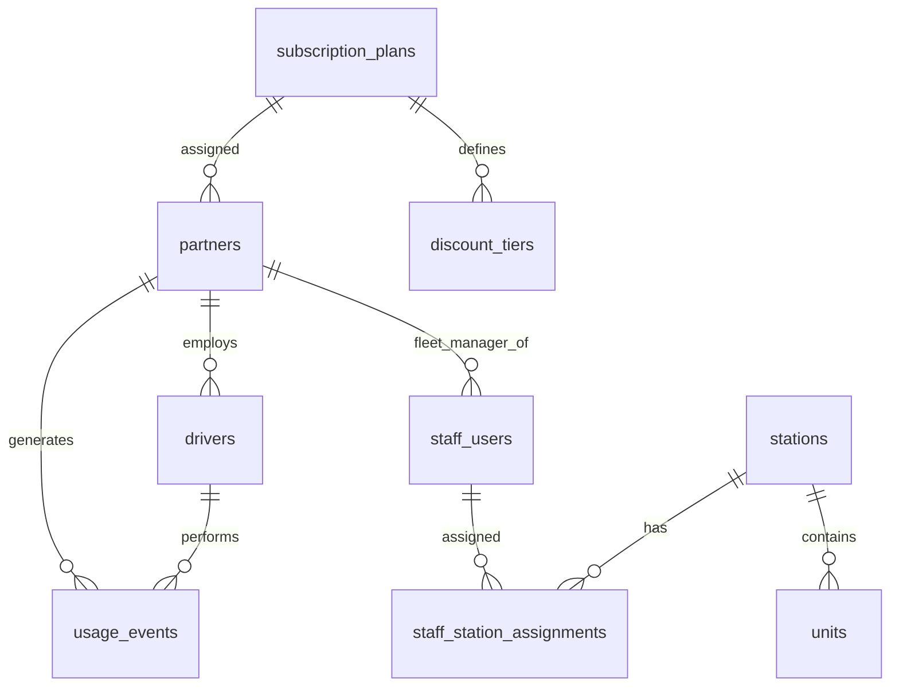

# 測試專案大綱 – 模組 B – SwapLoop 管理後台 SSR 應用程式

## 競賽時間

選手完成本模組的時間為 **3 小時**。

## 簡介

SwapLoop 是一個虛構的服務，用於在上海更安全地為電動自行車充電。它協助避免在公寓、走廊或其他不適合的場所為電動自行車電池充電——這類做法過去曾導致嚴重火災。

SwapLoop 站點提供：

- 適用於可相容、可拆卸電池之電動自行車的**電池交換**。
- 適用於內建電池之電動自行車的**整車充電車位**。

部分站點只提供其中一項服務；複合站點則兩項都提供。

本服務有兩個目標族群：**一般使用者**與**物流公司員工**（外送員）。兩者使用相同的站點服務；外送員帳號由其物流合作夥伴管理，而非自行註冊。

在**模組 B** 中，你必須打造**管理主控台**的**可運作原型**：一個以伺服器端渲染（SSR）的網頁應用程式，供平台人員、站點營運人員、車隊管理者與會計使用。

請依據 [`assets/db/swaploop_admin.sql`](./assets/db/swaploop_admin.sql) 所提供的 MySQL 種子資料建立應用程式，並遵循 [`assets/wireframes/`](./assets/wireframes/) 中的畫面結構。

## 專案與任務總述

實作一個可獨立執行的 SSR 管理應用程式，涵蓋：

1. 員工驗證與依角色呈現的應用程式外殼
2. 平台管理員的員工帳號管理
3. 站點與單元的 CRUD，含生命週期與相容性規則
4. 物流合作夥伴與司機的 CRUD
5. 依使用事件與訂閱方案計算的合作夥伴帳單摘要
6. 會計財務報表，含表格、長條圖與 CSV 匯出

### 環境與提供的素材

- 使用競賽環境中可用的伺服器端語言與框架。頁面必須是**伺服器端渲染的 HTML**。財務圖表允許使用用戶端腳本，但不得使用第三方圖表函式庫。
- 匯入 [`assets/db/swaploop_admin.sql`](./assets/db/swaploop_admin.sql)。
- 版面與欄位配置須符合 [`assets/wireframes/`](./assets/wireframes/)。
- 業務時區：`Asia/Shanghai`。帳單月份為該時區的日曆月。

### 實體詞彙

| 詞彙                    | 意義                                                                      |
| ----------------------- | ------------------------------------------------------------------------- |
| **SwapLoop Station**    | 完整服務據點（`SWAP`、`CHARGING` 或 `HYBRID`）                            |
| **Battery Slot**        | 最多容納一顆可交換電池的單一艙位（`SWAP_BAY`）                            |
| **E-bike Charging Bay** | 為整輛內建電池之電動自行車充電的車位（`BIKE_BAY`）                        |

種子資料中使用的相容性代碼：

- 可交換單元：`battery_type` 為 `SL-48` 或 `SL-60`
- 充電車位：`connector_type` 為 `GB-AC-48` 或 `GB-AC-60`

### 種子員工帳號

| 電子郵件                        | 角色             | 說明                                 |
| ------------------------------- | ---------------- | ------------------------------------ |
| `admin@swaploop.test`           | `PLATFORM_ADMIN` | 完整權限                             |
| `fleet.swift@swaploop.test`     | `FLEET_MANAGER`  | 合作夥伴 SwiftRice Delivery          |
| `fleet.blue@swaploop.test`      | `FLEET_MANAGER`  | 合作夥伴 BlueCrane Courier           |
| `station.east@swaploop.test`    | `STATION_ADMIN`  | 指派至 Haitang Garden East Gate      |
| `station.canal@swaploop.test`   | `STATION_ADMIN`  | 指派至 Canal View Delivery Hub       |
| `accountant@swaploop.test`      | `ACCOUNTANT`     | 僅財務                               |
| `suspended.admin@swaploop.test` | `PLATFORM_ADMIN` | 已停權 — 登入必須失敗                |

- 種子員工密碼（所有帳號）：`password123`。種子資料中的雜湊為 bcrypt；若你更新種子資料以配合所用技術棧，可以重新雜湊。

### 訂閱計費（概要）

每個物流合作夥伴都連結到一個**訂閱方案**。方案定義每月基本費用、包含的使用額度，以及超出額度後的超量費率。方案也定義**用量折扣級距**：當月用量越高，可解鎖越高的折扣百分比。該折扣僅適用於超量金額；每月基本費用不打折。

種子資料包含**至少兩個方案**，各自有費用、額度、超量費率與折扣級距。合作夥伴會被分配到這些方案。請從資料庫讀取方案與級距列，**不要**在應用程式原始碼中寫死商業數字。

已完成的服務活動以個別 **`usage_events`** 儲存。針對任一帳單月份，統計該合作夥伴 `completed_at` 落在該月（Asia/Shanghai）內的事件，再套用該合作夥伴目前的方案與對應級距。

### 資料庫結構

使用所提供的資料庫傾印。請勿重新命名評分所需的資料表或欄位。

## 需求

### 驗證與應用程式外殼

#### 登入與登出

- 員工以電子郵件與密碼對 `staff_users` 登入，並使用伺服器端 session。
- 無效憑證須顯示清楚的錯誤。已停權帳號不得登入，並須顯示不同的停權訊息。
- 已登入使用者可以登出。
- 驗證成功後，使用者應被導向儀表板頁面。

#### 應用程式外殼

登入成功後，外殼顯示：

- 標頭，含產品名稱 **SwapLoop Admin**，以及目前使用者的姓名與角色。
- 左側邊欄的導覽選單
- 用於顯示不同管理內容的主要區域

#### 導覽、使用者角色與存取控制

- 導覽權限僅限登出控制，以及該角色可使用的功能：

| 角色             | 允許的範圍                                                                                                                                                                                                                                      |
| ---------------- | ----------------------------------------------------------------------------------------------------------------------------------------------------------------------------------------------------------------------------------------------- |
| `PLATFORM_ADMIN` | 儀表板（全網路）；員工帳號（列表／新增／編輯）；站點（列表／新增／編輯）；單元（列表／新增／編輯）；合作夥伴（列表／新增／編輯）；司機（所有合作夥伴）；合作夥伴帳單摘要（任一合作夥伴）；財務報表（表格、圖表、CSV）                         |
| `FLEET_MANAGER`  | 儀表板（自己的合作夥伴）；司機（僅自己的合作夥伴：列表／新增／編輯）；合作夥伴帳單摘要（僅自己的合作夥伴）                                                                                                                                        |
| `STATION_ADMIN`  | 儀表板（指派的站點／單元）；站點（僅指派範圍：列表／編輯 — 不可新增）；指派站點下的單元（列表／新增／編輯）                                                                                                                                      |
| `ACCOUNTANT`     | 儀表板（財務入口）；僅財務報表（表格、圖表、CSV — 唯讀）                                                                                                                                                                                          |

- 未驗證訪客只能進入登入畫面。
- **超出權限範圍的請求須顯示 access-denied 線框稿，且不得在列表中揭露他人資料。**

### 儀表板頁面

- 簡易儀表板彙總與登入角色相關的數量（平台為全網路；車隊管理者為自己的合作夥伴；站點管理員為指派的站點／單元；會計為財務入口）。

### 列表頁

員工、站點、單元、合作夥伴與司機的索引畫面必須支援：

- 適合該實體的基本篩選（例如名稱／搜尋文字、狀態、類型／角色，以及相關的合作夥伴或站點）
- 分頁（每頁 **10** 筆）
- 「範圍內沒有資料」與「目前篩選沒有符合項目」須有不同的空狀態
- 範圍篩選，確保使用者永遠看不到其角色以外的列

### 員工帳號

平台管理員可以列出、新增與編輯員工帳號。

- 恰好指派四種角色之一。
- 車隊管理者必須綁定合作夥伴；其他角色不得帶有合作夥伴。
- 站點管理員必須至少指派一個站點；其他角色不得帶有站點指派。
- 狀態為啟用或停權。平台管理員不得停權自己的帳號。
- 新增使用者時密碼為必填；編輯時若密碼留空，則保留既有雜湊。

### 站點

平台管理員與站點管理員（在指派範圍內）可以管理站點。

- 站點類型：`SWAP`、`CHARGING`、`HYBRID`。
- 生命週期狀態：`PLANNED`、`ACTIVE`、`SUSPENDED`、`DECOMMISSIONED`。
- 允許的轉換：
  - `PLANNED` → `ACTIVE` 或 `DECOMMISSIONED`
  - `ACTIVE` → `SUSPENDED` 或 `DECOMMISSIONED`
  - `SUSPENDED` → `ACTIVE` 或 `DECOMMISSIONED`
  - `DECOMMISSIONED` → 不可再變更
- 新站點只能從 `PLANNED` 或 `ACTIVE` 開始。
- 已停權站點必須有停權原因；非停權站點不得保留原因。
- 只有平台管理員可以新增站點。

### 單元

在站點下管理電池艙位（`SWAP_BAY`）與電動自行車充電車位（`BIKE_BAY`）。

- 單元狀態：`AVAILABLE` 或 `BLOCKED`（封鎖必須有原因）。
- `SWAP_BAY` 必須有電池類型，且不得有連接器類型。
- `BIKE_BAY` 必須有連接器類型，且不得有電池類型。
- 標籤在同一站點內必須唯一。
- `SWAP` 站點只能有交換艙位；`CHARGING` 站點只能有充電車位；`HYBRID` 站點兩者都可以有。

### 合作夥伴與司機

- 平台管理員管理物流合作夥伴（名稱、狀態、聯絡方式、車隊規模、指派的訂閱方案）。
- 平台管理員管理所有司機；車隊管理者僅管理自己合作夥伴的司機。
- 司機有每個合作夥伴內唯一的員工代碼、唯一的電子郵件，以及啟用／停權狀態。

### 合作夥伴帳單摘要

為合作夥伴與所選日曆月提供畫面帳單摘要。

- 平台管理員可開啟任一合作夥伴；車隊管理者只能開啟自己的。
- 藉由彙總該合作夥伴該月的 `usage_events`，得出每月已完成使用次數。
- 套用該合作夥伴的訂閱方案：每月基本費用、包含額度、超出額度的超量，以及符合當月用量的用量折扣級距。折扣僅降低超量部分。
- 顯示清楚的明細（合作夥伴、期間、方案、使用次數、額度、超量、費用、折扣、合計）。金額為整數人民幣元（CNY yuan）。
- 商業數字與級距邊界來自資料庫種子資料。

### 財務報表

會計與平台管理員可以開啟所選月份的全網路財務檢視。

- 表格：每個合作夥伴一列，欄位與帳單摘要相同，並加上全網路合計。
- 圖表：各合作夥伴當月合計的直向長條圖，不得使用外部圖表函式庫（例如以自己的程式碼繪製 SVG 或 canvas）。
- 匯出該月各合作夥伴列的 CSV（UTF-8、標題列、欄位順序固定）。檔名必須能識別期間。

### 表單與無障礙

- 在伺服器端驗證輸入，失敗時顯示欄位層級錯誤。
- 狀態與錯誤不得只靠顏色來理解。
- 表單控制項須有標籤；焦點順序須符合線框稿。

## 評分

評分使用種子資料庫、線框稿，以及專家／腳本化操作流程。評審會檢查角色範圍、CRUD 行為、將使用事件彙總為月結帳單、正確套用各合作夥伴的方案與折扣級距、財務表格／圖表／CSV，以及拒絕存取的行為。

評分操作流程將在 Google Chrome 中進行，使用種子員工帳號與共用密碼 `password123`。

## 配分

本專案配分如下：

| WSOS 區塊 | 說明               | 分數     |
| --------- | ------------------ | -------- |
| 1         | 工作組織與自我管理 | 1.5      |
| 2         | 溝通與人際技能     | 1.5      |
| 3         | 設計實作           | 2.5      |
| 4         | 前端開發           | 3.25     |
| 5         | 後端開發           | 8.25     |
| **合計**  |                    | **17**   |

最終準則層級配分見 [`marking/marking-scheme.json`](./marking/marking-scheme.json)。
