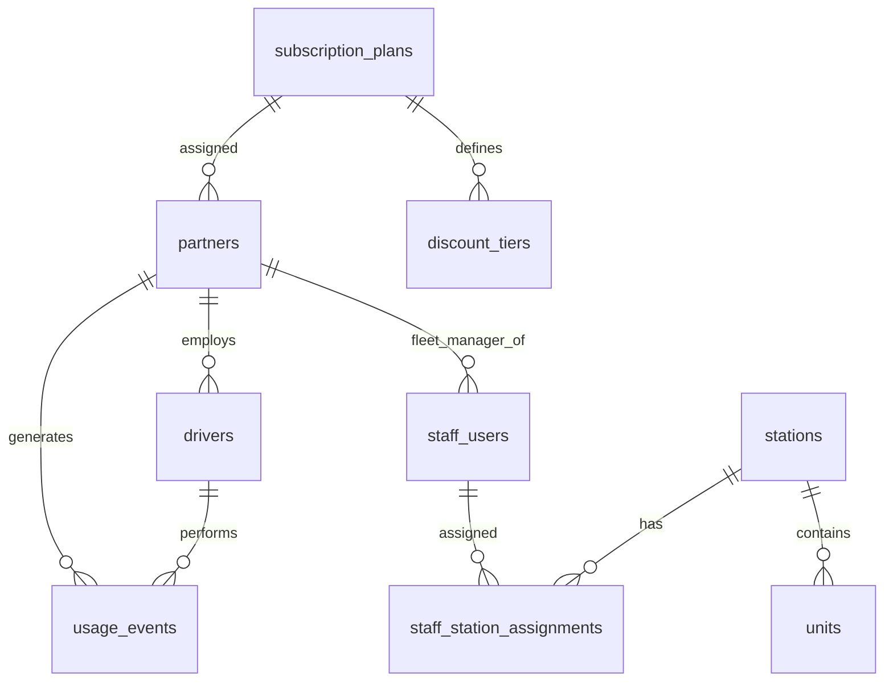

# Test Project Outline – Module B – SwapLoop Admin SSR Application

## Competition time

Competitors will have **3 hours** to complete this module.

## Introduction

SwapLoop is a fictional service for safer charging of electric bikes in Shanghai. It helps avoid charging e-bike batteries in apartments, corridors, or other unsuitable places — which previously led to serious fires.

SwapLoop stations offer:

- **Battery swap** for electric bikes with a compatible, removable battery.
- **E-bike charging bays** for electric bikes with a built-in battery.

Some stations provide only one of these services; hybrid stations provide both.

The service has two target groups: **individual users** and **delivery company employees** (couriers). Both use the same station services; courier accounts are managed through their delivery partner rather than self-registration.

In **Module B** you have to build **working prototypes** of the **administration console**: a server-rendered (SSR) web application for platform staff, station operators, delivery-fleet managers, and accountants.

Build the application against the provided MySQL seed in [`assets/db/swaploop_admin.sql`](./assets/db/swaploop_admin.sql). Follow the screen structure in [`assets/wireframes/`](./assets/wireframes/).

## General Description of Project and Tasks

Implement an independently runnable SSR admin application that covers:

1. Staff authentication and a role-aware application shell
2. Staff user management for platform admins
3. Stations and units CRUD with lifecycle and compatibility rules
4. Delivery partners and drivers CRUD
5. Partner billing summaries derived from usage events and subscription plans
6. Accountant finance report with a table, a bar chart, and CSV export

### Environment and provided assets

- Use a server-side language and framework available in the competition environment. Pages are **server-rendered HTML**. Client-side script is allowed for the finance chart, built without third-party chart libraries.
- Import [`assets/db/swaploop_admin.sql`](./assets/db/swaploop_admin.sql).
- Match layout and field placement to [`assets/wireframes/`](./assets/wireframes/).
- Business timezone: `Asia/Shanghai`. Billing months are calendar months in that timezone.

### Physical vocabulary

| Term                    | Meaning                                                                 |
| ----------------------- | ----------------------------------------------------------------------- |
| **SwapLoop Station**    | Full service location (`SWAP`, `CHARGING`, or `HYBRID`)                 |
| **Battery Slot**        | One compartment that holds at most one swappable battery (`SWAP_BAY`)   |
| **E-bike Charging Bay** | Bay that charges a whole e-bike with an integrated battery (`BIKE_BAY`) |

Compatibility codes used in the seed:

- Swappable units: `battery_type` `SL-48` or `SL-60`
- Charging bays: `connector_type` `GB-AC-48` or `GB-AC-60`

### Seeded staff accounts

| Email                           | Role             | Notes                                |
| ------------------------------- | ---------------- | ------------------------------------ |
| `admin@swaploop.test`           | `PLATFORM_ADMIN` | Full access                          |
| `fleet.swift@swaploop.test`     | `FLEET_MANAGER`  | Partner SwiftRice Delivery           |
| `fleet.blue@swaploop.test`      | `FLEET_MANAGER`  | Partner BlueCrane Courier            |
| `station.east@swaploop.test`    | `STATION_ADMIN`  | Assigned to Haitang Garden East Gate |
| `station.canal@swaploop.test`   | `STATION_ADMIN`  | Assigned to Canal View Delivery Hub  |
| `accountant@swaploop.test`      | `ACCOUNTANT`     | Finance only                         |
| `suspended.admin@swaploop.test` | `PLATFORM_ADMIN` | Suspended — sign-in must fail        |

- Seeded staff password (all accounts): `password123`. Seeded `password_hash` values are bcrypt. Verify them with bcrypt. Do not replace them with another hashing algorithm.

If you use node.js, you can use the `bcryptjs` library to verify and store passwords:

```js
import bcrypt from "bcryptjs";

const password = "password123";
const hashedPassword = bcrypt.hashSync(password, 10);
```

```js
import bcrypt from "bcryptjs";

const isValid = bcrypt.compareSync(password, hashedPassword);
```

PHP has bcrypt support built-in.

### Subscription billing (overview)

Each delivery partner is linked to a **subscription plan**. Plans define a monthly base fee, an included use quota, and an overage rate for uses beyond that quota. Plans also define **volume discount tiers**: higher monthly usage unlocks a higher discount percent. That discount applies only to the overage amount; the monthly base fee stays undiscounted.

The seed contains **at least two plans**, each with its own fee, quota, overage rate, and discount tiers. Partners are assigned across those plans. Read the plan and tier rows from the database — do not hard-code commercial numbers in application source.

Completed service activity is stored as individual **`usage_events`**. For any billing month, count that partner’s events whose `completed_at` falls in the month (Asia/Shanghai), then apply the partner’s current plan and matching tier.

### Database structure

Use the supplied dump. Do not rename tables or columns needed for assessment. Keep the seeded bcrypt `password_hash` values.



## Requirements

### Authentication and application shell

#### Sign in and Sign Out

- Staff sign in with email and password against `staff_users`, using a server-side session. Verify passwords with bcrypt.
- Invalid credentials show a clear error. Suspended accounts cannot sign in and show a distinct suspended message.
- Signed-in users can sign out.
- After authentication, the user should be redirected to the Dashboard page.

#### Application Shell

After successful login, the shell shows:

- a header with the product name **SwapLoop Admin**, the current user’s name and role.
- a navigation menu in the left sidebar
- main area for the different admin contents

#### Navigation, User Roles and Access Control

- Navigation access limited to a sign-out control and what that role may use:

| Role             | Allowed areas                                                                                                                                                                                                                                   |
| ---------------- | ----------------------------------------------------------------------------------------------------------------------------------------------------------------------------------------------------------------------------------------------- |
| `PLATFORM_ADMIN` | Dashboard (network-wide); Staff users (list/create/edit); Stations (list/create/edit); Units (list/create/edit); Partners (list/create/edit); Drivers (all partners); Partner billing summary (any partner); Finance report (table, chart, CSV) |
| `FLEET_MANAGER`  | Dashboard (own partner); Drivers (own partner only: list/create/edit); Partner billing summary (own partner only)                                                                                                                               |
| `STATION_ADMIN`  | Dashboard (assigned stations/units); Stations (assigned only: list/edit — no create); Units under assigned stations (list/create/edit)                                                                                                          |
| `ACCOUNTANT`     | Dashboard (finance entry point); Finance report only (table, chart, CSV — read-only)                                                                                                                                                            |

- Unauthenticated visitors only reach the login experience.
- **Cross-scope requests show the access-denied wireframe and must not expose foreign data in lists.**

### Dashboard page

- A simple dashboard summarises counts relevant to the signed-in role (network-wide for platform; own partner for fleet managers; assigned stations/units for station admins; finance entry point for accountants).

### List pages

Index screens for staff, stations, units, partners, and drivers must support:

- Basic filtering appropriate to the entity (for example name/search text, status, type/role, and partner or station where relevant)
- Pagination (page size **10**)
- Distinct empty states for “no records in scope” versus “no matches for the current filters”
- Scope filtering so users never see rows outside their role

### Staff users

Platform admins can list, create, and edit staff accounts.

- Assign exactly one of the four roles.
- Fleet managers require a partner; other roles must not carry a partner.
- Station admins require at least one station assignment; other roles must not carry station assignments.
- Status is active or suspended. A platform admin cannot suspend their own account.
- Password is required when creating a user; store it with bcrypt. On edit, leaving password blank keeps the existing hash; a new password must also be stored with bcrypt.

### Stations

Platform admins and station admins (within assignment) can manage stations.

- Station types: `SWAP`, `CHARGING`, `HYBRID`.
- Lifecycle states: `PLANNED`, `ACTIVE`, `SUSPENDED`, `DECOMMISSIONED`.
- Allowed transitions:
  - `PLANNED` → `ACTIVE` or `DECOMMISSIONED`
  - `ACTIVE` → `SUSPENDED` or `DECOMMISSIONED`
  - `SUSPENDED` → `ACTIVE` or `DECOMMISSIONED`
  - `DECOMMISSIONED` → no further changes
- New stations start as `PLANNED` or `ACTIVE` only.
- Suspended stations require a suspension reason; non-suspended stations must not keep a reason.
- Only platform admins may create stations.

### Units

Manage Battery Slots (`SWAP_BAY`) and E-bike Charging Bays (`BIKE_BAY`) under stations.

- Unit status: `AVAILABLE` or `BLOCKED` (blocked requires a reason).
- `SWAP_BAY` requires a battery type and must not have a connector type.
- `BIKE_BAY` requires a connector type and must not have a battery type.
- Labels are unique within a station.
- `SWAP` stations may only have swap bays; `CHARGING` stations only charging bays; `HYBRID` stations may have both.

### Partners and drivers

- Platform admins manage delivery partners (name, status, contact, fleet size, assigned subscription plan).
- Platform admins manage all drivers; fleet managers manage only drivers for their partner.
- Drivers have an employee code unique per partner, a unique email, and an active/suspended status.

### Partner billing summary

Provide an on-screen billing summary for a partner and a selected calendar month.

- Platform admins may open any partner; fleet managers only their own.
- Derive monthly completed uses by aggregating `usage_events` for that partner and month.
- Apply the partner’s subscription plan: monthly base fee, included quota, overage beyond quota, and the volume discount tier that matches the month’s usage. The discount reduces the overage portion only.
- Show a clear breakdown (partner, period, plan, uses, quota, overage, fees, discount, total). Amounts are whole CNY yuan.
- Commercial numbers and tier boundaries come from the database seed.

### Finance report

Accountants and platform admins can open a network finance view for a selected month.

- Table: one row per partner with the same calculated fields as the billing summary, plus a network total.
- Chart: a vertical bar chart of each partner’s total for the month, implemented without an external chart library (for example SVG or canvas drawn by your own code).
- CSV export of the per-partner rows for that month (UTF-8, header row, deterministic column order). Filename must identify the period.

### Forms and accessibility

- Validate input server-side and show field-level errors on failure.
- Status and errors must be understandable without relying on colour alone.
- Form controls have labels; focus order follows the wireframes.

## Assessment

Assessment uses the seeded database, the wireframes, and expert / scripted walkthroughs. Evaluators will check role scoping, CRUD behaviour, aggregation of usage events into monthly billing, correct application of each partner’s plan and discount tiers, the finance table/chart/CSV, and access-denied behaviour.

Assessment walkthroughs will be performed in Google Chrome using the seeded staff accounts and the shared password `password123`.

## Mark distribution

The mark distribution for this project is as follows:

| WSOS SECTION | Description                            | Points |
| ------------ | -------------------------------------- | ------ |
| 1            | Work organization and self-management  | 1.5    |
| 2            | Communication and interpersonal skills | 1.5    |
| 3            | Design Implementation                  | 2.5    |
| 4            | Front-End Development                  | 3.25   |
| 5            | Back-End Development                   | 8.25   |
| **Total**    |                                        | **17** |
