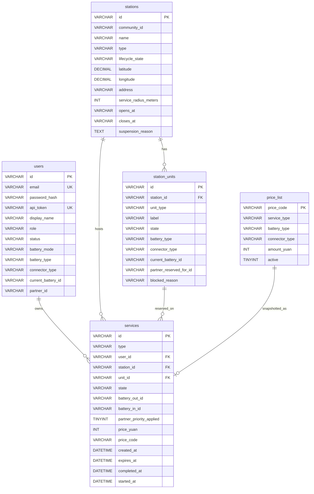

# 測試專案大綱 – 模組 C – SwapLoop REST API 後端

## 競賽時間

選手完成本模組的時間為 **3 小時**。

## 簡介

SwapLoop 是一個虛構的服務，用於在上海更安全地為電動自行車充電。它協助避免在公寓、走廊或其他不適合的場所為電動自行車電池充電——這類做法過去曾導致嚴重火災。

SwapLoop 站點提供：

- 適用於可相容、可拆卸電池之電動自行車的**電池交換**。
- 適用於內建電池之電動自行車的**整車充電車位**。

部分站點只提供其中一項服務；複合站點則兩項都提供。

騎士以電動自行車資料（可交換電池類型或內建連接器類型）註冊，然後依列表、位置、可用性或掃描站點 QR 碼尋找站點。在站點，他們可以將耗盡的相容電池**換**成已充電的電池，或在充電車位為內建電池的車輛**充電**。每次到訪都是短暫預約，騎士須在現場開始並完成；未完成的預留會過期。網路依每次完成的服務以**隨用隨付**計費。

系統區分下列實體單元：

- **SwapLoop Station** 是完整服務據點。
- **E-bike Charging Bay** 用於為整輛內建電池之電動自行車充電。
- **Battery Swap Cabinet** 是儲存並為可交換電池充電的設備。
- **Battery Slot** 是 Battery Swap Cabinet 中的單一艙位。

目前僅支援兩種可交換電池類型，以及兩種適用於內建電池電動自行車的充電連接器類型：

- 可交換電池類型：`SL-48` 與 `SL-60`
- 充電連接器類型：`GB-AC-48` 與 `GB-AC-60`

在**模組 C** 中，選手必須打造 **Main Backend** 的**可運作原型**：一個供模組 D SPA 呼叫的 REST API。使用者註冊、預約、末次充電隔離、即時充電模擬協調，以及隨用隨付定價的業務邏輯都在此實作。

整體架構中還有 **Station Service**：一個代表站點／櫃體硬體與遙測的獨立內部服務。**Station Service** 模擬電動自行車充電工作階段，以及可交換電池包的末次充電事件遙測。本模組已提供此服務，選手不需要實作它。Station Service API **不受保護**，僅應由 **Main Backend** 呼叫。


## 專案與任務總述

依所述端點與業務邏輯實作 Main Backend。以下為高層總覽；詳細規格見 [需求](#需求) 一節：

- 實作驗證與授權（不透明 bearer token）
- 實作一致的錯誤處理
- 列出並篩選可用站點（列表、篩選、詳情、相容性、可選的騎士可用性）
- 實作換電與充電的統一服務
- 在換電預約前，透過 Station Service 強制執行末次充電安全
- 啟動 Station Service 充電車位工作階段並公開其遙測
- 在確認／取車時套用隨用隨付價格，並公開價目表

### 環境與提供的素材

使用競賽環境中可用的伺服器端語言與框架打造 API。

- 使用 **MySQL** 做持久化。匯入 [`assets/db/swaploop_db.sql`](./assets/db/swaploop_db.sql)。
- 依 [`assets/api/main-backend.openapi.yaml`](./assets/api/main-backend.openapi.yaml) 實作 API。該文件是路徑、請求、回應、安全性與錯誤的契約。回應與請求結構描述、回應狀態碼與錯誤代碼必須與 OpenAPI 契約完全相符。離線 Swagger UI：[`assets/api/main-backend-docs/index.html`](./assets/api/main-backend-docs/index.html)。
- **Main Backend** 的 Bruno / OpenCollection 套件位於 [`assets/bruno/main-backend`](./assets/bruno/main-backend)。
- 透過 `https://cXX-YYYY-station-service.sitc.skillsit.eu` 存取所提供的 **Station Service**（將 `cXX` / `YYYY` 替換為競賽使用者名稱與 PIN）。其 API 不受保護。見 [`assets/api/station-service-openapi.yaml`](./assets/api/station-service-openapi.yaml)、離線 Swagger UI [`assets/api/station-service-docs/index.html`](./assets/api/station-service-docs/index.html)，以及 Station Service Bruno 套件 [`assets/bruno/station-service`](./assets/bruno/station-service)。
- **資料庫重設：** 若要重新載入模組 C 的 MySQL 種子資料（`assets/db/swaploop_db.sql`），請呼叫 Station Service `POST https://cXX-YYYY-station-service.sitc.skillsit.eu/reset`。不需要驗證。評審與所提供的 Bruno 套件以相同方式使用此端點。

本文件中所有 Main Backend API 路徑都相對於你所執行主機上的 `/api/v1`（例如 `POST /auth/login` 代表 `POST {baseUrl}/api/v1/auth/login`）。你部署的 Main Backend 位於 `https://cXX-YYYY-module-c.sitc.skillsit.eu`（將 `cXX` / `YYYY` 替換為競賽使用者名稱與 PIN）。

### 資料庫結構

請原樣使用所提供的資料庫種子（`assets/db/swaploop_db.sql`）。你不需要變更任何資料表的結構。下圖顯示資料庫中的資料表：



#### 資料表說明

| 資料表            | 說明                                                                                 |
| ----------------- | ------------------------------------------------------------------------------------ |
| **users**         | 已註冊騎士及其車輛詳情。SWAPPABLE 騎士會追蹤 `current_battery_id`。                  |
| **stations**      | 可探索的據點（`SWAP` / `CHARGING` / `HYBRID`），含狀態與位置                         |
| **station_units** | `SWAP_BAY`（Battery Slot）或 `BIKE_BAY`（E-bike Charging Bay），含狀態與相容性欄位。 |
| **services**      | 換電或充電的單一生命週期列；價格欄位在完成時填入。                                   |
| **price_list**    | 各服務類型（換電／充電）的隨用隨付價格，以整數人民幣元儲存。                         |

### 技術限制

- 所有正常與錯誤回應皆回傳 JSON。
- 業務時區使用 `Asia/Shanghai`。時間戳以帶明確偏移的 ISO 8601 字串回傳。

## 需求

Main Backend 必須實作下列行為。所有路由、請求主體、回應與錯誤必須符合 [`assets/api/main-backend.openapi.yaml`](./assets/api/main-backend.openapi.yaml)。

**重要：** **不要**在 Main Backend 內重新實作 Station Service 路由。請依 [透過 Station Service 進行電池安全](#透過-station-service-進行電池安全) 與 [透過 Station Service 進行即時充電車位充電](#透過-station-service-進行即時充電車位充電) 的說明，呼叫所提供的 Station Service 以取得末次充電遙測與即時充電車位工作階段。

**資料庫：** 匯入 [`assets/db/swaploop_db.sql`](./assets/db/swaploop_db.sql)。選手不得變更評分所需的種子識別碼。

### 錯誤處理

端點必須回傳適當的 HTTP 狀態，以及至少含有機器可讀 `code` 與人類可讀 `message` 的 JSON 物件：

| 狀態  | 使用時機                                               |
| ----- | ------------------------------------------------------ |
| `401` | 缺少或無效的驗證                                       |
| `403` | 已停權帳號、所有權檢查失敗，或禁止的動作               |
| `404` | 可安全揭露的未知資源                                   |
| `409` | 預約衝突、無效狀態轉換、進行中服務衝突、不安全的電池包 |
| `422` | 語法有效但未通過驗證或相容性規則的請求                 |
| `502` | 套用失敗即關閉行為時，上游 Station Service 失敗        |
| `5xx` | 僅用於非預期的伺服器失敗                               |

範例：

```json
{
  "code": "CONFLICT",
  "message": "You already have an active service."
}
```

### 須在 Main Backend 實作的端點

#### API 一般規則

- 動態資料必須來自資料庫（以及有指定時的 Station Service）。
- URL 中的占位參數以前置冒號標示（例如 `:stationId`）。
- 物件中的屬性順序不重要；有指定時陣列順序很重要（例如由近到遠的站點）。
- JSON 回應的 `Content-Type` 為 `application/json`。
- 下列路徑相對於 `/api/v1`。
- 除非標示為公開，端點需要有效的 Bearer token。

---

#### 健康檢查

##### GET /health

公開存活探測。不需要驗證。

**回應：** `200 OK`

```json
{
  "status": "ok"
}
```

#### 驗證與授權

Main Backend 使用**不透明** bearer token。將每個 token 存在 `users` 資料表的 `api_token` 欄（沒有 sessions 資料表，也沒有 JWT）。請以安全的隨機產生器建立 token。

1. `POST /auth/login` 與 `POST /auth/register` 驗證或建立使用者，且只回傳 `{ "token": "..." }`。
2. 用戶端在受保護路由送出 `Authorization: Bearer <token>`。
3. 每次受保護請求時，查找 `api_token` 欄符合該 bearer token 的使用者。
4. 缺少或未知 token → `401 UNAUTHORIZED`。
5. 已停權帳號不得登入，也不得呼叫受保護路由 → `403 FORBIDDEN`。
6. 自行註冊只建立 `RIDER` / `ACTIVE`。

##### POST /auth/register

不需要驗證。建立含車輛詳情的新帳號。

使用者可提供電動自行車資料來註冊帳號：

- `batteryMode`：`SWAPPABLE` 且 `batteryType`：`SL-48` \| `SL-60`，或
- `batteryMode`：`INTEGRATED` 且 `connectorType`：`GB-AC-48` \| `GB-AC-60`。

無效的模式／類型組合以 `422` 拒絕。
重複電子郵件以 `409 CONFLICT` 拒絕。

將密碼以 bcrypt 雜湊存入 `password_hash`。回傳新使用者的不透明 `api_token`。

建立的使用者角色為 `RIDER`，狀態為 `ACTIVE`。

`voltageClass`（`48V` / `60V`）由所選類型衍生；它不是獨立欄位。

**請求範例（可交換）：**

```json
{
  "email": "new.rider@swaploop.test",
  "password": "password123",
  "displayName": "New Rider",
  "batteryMode": "SWAPPABLE",
  "batteryType": "SL-48"
}
```

**請求範例（內建）：**

```json
{
  "email": "charge.rider@swaploop.test",
  "password": "password123",
  "displayName": "Charge Rider",
  "batteryMode": "INTEGRATED",
  "connectorType": "GB-AC-48"
}
```

**回應：** `201 Created`

```json
{
  "token": "sl_tok_rider-xxxxxxxx"
}
```

---

##### POST /auth/login

不需要驗證。以 bcrypt `password_hash` 驗證電子郵件 + 密碼。登入成功時儲存並回傳使用者的不透明 `api_token`。已停權使用者不得登入。

種子使用者：

| Bearer token       | 帳號        | 姓名       | 電子郵件                   | 角色    | 狀態        | 資料                  |
| ------------------ | ----------- | ---------- | -------------------------- | ------- | ----------- | --------------------- |
| `sl_tok_rider-001` | `rider-001` | Lin Xiaoyu | `lin.xiaoyu@swaploop.test` | `RIDER` | `ACTIVE`    | SWAPPABLE / SL-48     |
| `sl_tok_rider-002` | `rider-002` | Chen Wei   | `chen.wei@swaploop.test`   | `RIDER` | `ACTIVE`    | INTEGRATED / GB-AC-48 |
| `sl_tok_rider-003` | `rider-003` | Zhao Min   | `zhao.min@swaploop.test`   | `RIDER` | `ACTIVE`    | SWAPPABLE / SL-48     |
| `sl_tok_rider-006` | `rider-006` | Sun Hao    | `sun.hao@swaploop.test`    | `RIDER` | `SUSPENDED` | INTEGRATED / GB-AC-60 |

所有種子使用者的明文密碼：`password123`。

**請求範例：**

```json
{
  "email": "lin.xiaoyu@swaploop.test",
  "password": "password123"
}
```

**回應：** `200 OK`

```json
{
  "token": "sl_tok_rider-001"
}
```

**錯誤回應（範例）：** `401`（`UNAUTHORIZED`）、`403`（已停權為 `FORBIDDEN`）、`422`（`VALIDATION_ERROR`）。

---

#### 目前騎士

##### GET /me

受保護。回傳已驗證使用者的公開個人資料（回應中不得回傳密碼或 token）。包含衍生的 `voltageClass`。

**回應：** `200 OK`

```json
{
  "id": "rider-001",
  "email": "lin.xiaoyu@swaploop.test",
  "displayName": "Lin Xiaoyu",
  "role": "RIDER",
  "status": "ACTIVE",
  "batteryMode": "SWAPPABLE",
  "batteryType": "SL-48",
  "connectorType": null,
  "voltageClass": "48V",
  "currentBatteryId": "battery-101",
  "partnerId": null
}
```

**錯誤回應（範例）：** `401`（`UNAUTHORIZED`）、`403`（`FORBIDDEN`）。

---

##### PATCH /me

受保護。部分更新 `displayName` 與／或車輛詳情（`batteryMode`、`batteryType`、`connectorType`），驗證規則與註冊端點相同。

**回應：** `200 OK` — 更新後的公開使用者物件。

**錯誤回應（範例）：** `422`（`VALIDATION_ERROR`）、`401`、`403`。

---

##### GET /me/activity

受保護。回傳騎士目前與過去的活動。

- **`active`** — 目前進行中的服務，若沒有則為 `null`。進行中指非終態（`RESERVED`、`STARTED`、`CHARGING`、`READY_FOR_COLLECTION`）。若唯一候選為 `RESERVED` 且 `expiresAt` ≤ 現在，先使其過期（服務 → `EXPIRED`；`SWAP_BAY`：`RESERVED` → `READY`；`BIKE_BAY`：`RESERVED` → `AVAILABLE`），並回傳 `"active": null`。
- **`recent`** — 顯示最多 5 筆騎士處於終態（`CONFIRMED`、`COLLECTED`、`EXPIRED`、`CANCELLED`、`SAFETY_CUTOFF`）的過去服務，最新者在前（依 `completedAt`，再 `expiresAt`，再 `createdAt` 排序）。

**回應：** `200 OK`

```json
{
  "active": {
    "id": "service-ab12cd34",
    "type": "SWAP",
    "riderId": "rider-001",
    "stationId": "station-001",
    "unitId": "unit-001",
    "state": "RESERVED",
    "batteryOutId": "battery-001",
    "batteryInId": null,
    "priceYuan": null,
    "priceCode": null,
    "partnerPriorityApplied": false,
    "createdAt": "2026-08-15T12:00:00.000+08:00",
    "expiresAt": "2026-08-15T12:00:10.000+08:00",
    "startedAt": null,
    "completedAt": null,
    "timestamp": "2026-08-15T12:00:00.000+08:00"
  },
  "recent": [
    {
      "id": "service-9f81e2c0",
      "type": "SWAP",
      "riderId": "rider-001",
      "stationId": "station-002",
      "unitId": "unit-008",
      "state": "CONFIRMED",
      "batteryOutId": "battery-010",
      "batteryInId": "battery-101",
      "priceYuan": 5,
      "priceCode": "SWAP_SL-48",
      "partnerPriorityApplied": false,
      "createdAt": "2026-08-14T18:00:00.000+08:00",
      "expiresAt": "2026-08-14T18:00:10.000+08:00",
      "startedAt": "2026-08-14T18:00:02.000+08:00",
      "completedAt": "2026-08-14T18:00:05.000+08:00",
      "timestamp": "2026-08-14T18:00:05.000+08:00"
    }
  ]
}
```

當沒有進行中服務也沒有歷史時，回傳 `"active": null` 與 `"recent": []`。已完成服務包含 `priceYuan` / `priceCode`。

---

#### 站點

##### GET /stations

列出站點，可選篩選。提供 `lat` / `lng` 時依距離由近到遠排序；否則依 `name` 排序。提供 `lat` / `lng` 時包含 `distanceMeters`。請以 [`assets/handouts/handout-station-distance.md`](./assets/handouts/handout-station-distance.md) 中的半正矢（Haversine）公式計算。

不需要驗證，但已驗證請求必須為每個站點一併包含 `riderAvailability`（見下方）。

**查詢參數：**

| 參數            | 說明                                                                                               |
| --------------- | -------------------------------------------------------------------------------------------------- |
| `lat`、`lng`    | 查詢座標（兩者必須一併提供）。回應中每個站點會有 `distanceMeters`；依距離由近到遠排序。            |
| `radiusMeters`  | 查詢最大距離（公尺）。可選；當有 `lat`/`lng` 時預設 `1500`。只保留 `distanceMeters` ≤ 此值的站點。 |
| `type`          | `SWAP` \| `CHARGING` \| `HYBRID`                                                                   |
| `service`       | `SWAP` \| `BIKE_BAY` — 相容性／可用性篩選                                                          |
| `batteryType`   | 搭配 `service=SWAP`：`SL-48` \| `SL-60`                                                            |
| `connectorType` | 搭配 `service=BIKE_BAY`：`GB-AC-48` \| `GB-AC-60`                                                  |

已停權站點在未篩選列表中仍可被發現，但套用 `service` 篩選時不得提供可預約容量。

**回應：** `200 OK`

沒有 `lat` / `lng` 時，省略 `distanceMeters`：

```json
{
  "stations": [
    {
      "id": "station-001",
      "name": "Haitang Garden East Gate",
      "type": "HYBRID",
      "lifecycleState": "ACTIVE",
      "latitude": 31.2308,
      "longitude": 121.4717,
      "address": "88 Haitang Community Road",
      "compatibility": {
        "services": ["SWAP", "BIKE_BAY"],
        "batteryTypes": ["SL-48", "SL-60"],
        "connectorTypes": ["GB-AC-48"],
        "voltageClasses": ["48V", "60V"]
      }
    }
  ]
}
```

有 `lat` / `lng` 時（例如 `?lat=31.2308&lng=121.4717`），每個站點包含 `distanceMeters`（整數公尺）。超出 `radiusMeters` 的站點會被省略：

```json
{
  "stations": [
    {
      "id": "station-001",
      "name": "Haitang Garden East Gate",
      "type": "HYBRID",
      "lifecycleState": "ACTIVE",
      "latitude": 31.2308,
      "longitude": 121.4717,
      "address": "88 Haitang Community Road",
      "compatibility": {
        "services": ["SWAP", "BIKE_BAY"],
        "batteryTypes": ["SL-48", "SL-60"],
        "connectorTypes": ["GB-AC-48"],
        "voltageClasses": ["48V", "60V"]
      },
      "distanceMeters": 0
    }
  ]
}
```

帶有 bearer token 時，每個站點還必須包含依已驗證騎士計算的 `riderAvailability`：

```json
{
  "stations": [
    {
      "id": "station-001",
      "name": "Haitang Garden East Gate",
      "type": "HYBRID",
      "lifecycleState": "ACTIVE",
      "latitude": 31.2308,
      "longitude": 121.4717,
      "address": "88 Haitang Community Road",
      "compatibility": {
        "services": ["SWAP", "BIKE_BAY"],
        "batteryTypes": ["SL-48", "SL-60"],
        "connectorTypes": ["GB-AC-48"],
        "voltageClasses": ["48V", "60V"]
      },
      "riderAvailability": {
        "compatibleReadyBattery": true,
        "compatibleChargingBay": false
      }
    }
  ]
}
```

---

##### GET /stations/:stationId

含相容性的站點詳情。
不需要驗證，但已驗證請求必須為該站點一併包含 `riderAvailability`，結構與邏輯與列出站點相同。

**回應：** `200 OK` — 如上的站點物件（單一資源，不包在 `stations` 中）。

**錯誤回應（範例）：** `404`（`NOT_FOUND`）。

---

#### 服務

統一服務（換電與充電）存在同一列 `services` 中，擁有完整生命週期（`type` 為 `SWAP` \| `CHARGING`，加上依類型而定的 `state`）。
每次服務使用（換電或充電）都存在 `services` 資料表中（類型：`SWAP` 或 `CHARGING`），並帶有依類型而定的目前狀態。

**`SWAP` 狀態：** `RESERVED` → `STARTED`（`/start`）→ `CONFIRMED`（`/confirm`）。可從 `RESERVED` 或 `STARTED` 取消。
**`CHARGING` 狀態：** `RESERVED` → `CHARGING`（`/start`）→ `READY_FOR_COLLECTION`（經 `/charging-status` 自動）→ `COLLECTED`（`/collect`）。僅能從 `RESERVED` 取消。

轉換可安全重試：若轉換已成功，再次呼叫會回傳目前服務，且不得再套用一次變更。

##### POST /services

受保護。建立 **10 秒**預約預留（`expiresAt` = 現在 + **10 秒**）。（注意：短時間僅供測試；實際部署會使用長得多的預留，通常為 **15–30 分鐘**。）

騎士一次只能有一筆進行中服務。在仍有進行中服務時再建立另一筆會回傳 `409`。

**行為：**

- `SWAP`：騎士的 `batteryType` 必須為 `SWAPPABLE`。以原子方式預留一個符合的 `READY` `SWAP_BAY`。接受電池包前，評估末次充電遙測（見下方 **透過 Station Service 進行電池安全**）；隔離／略過不安全或 `NO_TELEMETRY` 的電池包，並嘗試下一個候選。
- `CHARGING`：騎士的 `batteryType` 必須為 `INTEGRATED`。以原子方式預留一個符合的 AVAILABLE `BIKE_BAY`。
- 每位騎士一筆進行中服務。在強制該規則前，先使該騎士任何逾期的 `RESERVED` 預留過期（`expiresAt` ≤ 現在 → 服務 `EXPIRED`；`SWAP_BAY`：`RESERVED` → `READY`；`BIKE_BAY`：`RESERVED` → `AVAILABLE`），以免逾時預留阻擋新的建立。
- 在建立的服務上將 `expiresAt` 設為 **現在 + 10 秒**。（後續動作如 `POST /services/:serviceId/start` 會檢查 `expiresAt`。）

**透過 Station Service 進行電池安全**

預留可交換電池包前，Main Backend 必須呼叫 Station Service：

```http
GET {STATION_SERVICE}/api/batteries/{batteryId}/last-charging-telemetry
```

Station Service 回傳該電池末次充電工作階段的原始遙測樣本（`time`、`temperature`、`chargingVoltage`）。**隔離決定屬於 Main Backend。**

若**任一**規則失敗，拒絕該電池包（隔離艙位／回傳 `409 CONFLICT`）：

1. **尖峰**：任一樣本的 `temperature > 55`。
2. **持續過熱**：一段連續樣本序列滿足 `time(last) − time(first) ≥ 5 分鐘`，且那些溫度的算術平均 `> 50`。單一高溫讀數本身不滿足規則 2。

已知電池若樣本為空，Station Service 回傳 `404 NO_TELEMETRY`。**不要**把它當成健康。不安全或 `NO_TELEMETRY` 的電池包不得提供換電。

種子測試夾具：

| `batteryId`          | 站點          | 預期結果              |
| -------------------- | ------------- | --------------------- |
| `battery-001`        | `station-001` | 安全 — 允許預約       |
| `battery-005`        | `station-002` | 尖峰 — 隔離／拒絕     |
| `battery-007`        | `station-005` | 持續過熱 — 隔離／拒絕 |
| `battery-002`、`003` | `station-001` | `NO_TELEMETRY` — 拒絕 |
| `battery-006`、`010` | `station-002` | `NO_TELEMETRY` — 拒絕 |

**請求範例：**

```json
{
  "type": "SWAP",
  "stationId": "station-001"
}
```

**回應：** `201 Created` — 服務物件，例如：

```json
{
  "id": "service-ab12cd34",
  "type": "SWAP",
  "riderId": "rider-001",
  "stationId": "station-001",
  "unitId": "unit-001",
  "state": "RESERVED",
  "batteryOutId": "battery-001",
  "batteryInId": null,
  "priceYuan": null,
  "priceCode": null,
  "createdAt": "2026-08-15T12:00:00.000+08:00",
  "expiresAt": "2026-08-15T12:00:10.000+08:00",
  "startedAt": null,
  "completedAt": null
}
```

**錯誤回應（範例）：** `422`（錯誤的車輛資料）、`409`（沒有容量／沒有進行中服務／所有電池包不安全）、`401`、`403`。

---

##### GET /services/:serviceId

受保護。僅擁有者可讀取該服務。

**回應：** `200 OK` — 服務物件（見 `POST /services`）。

**錯誤回應（範例）：** `404`、`403`、`401`。

---

##### POST /services/:serviceId/start

受保護，僅允許該服務的擁有者。

若服務仍為 `RESERVED` 且 `expiresAt` ≤ 現在：將服務設為 `EXPIRED`，歸還單元（在 `station_units` 資料表中：`SWAP_BAY`：`RESERVED` → `READY`；`BIKE_BAY`：`RESERVED` → `AVAILABLE`），並回傳 `409`（預留已過期）。逾期預留不得開始。

**SWAP：**
`RESERVED` → `STARTED`（模擬櫃門開啟）。若服務已是 `STARTED`，以 `200` 原樣回傳（不要失敗，也不要再開始一次）。

**透過 Station Service 進行即時充電車位充電**

**CHARGING：**
當騎士開始 `CHARGING` 服務時，Main Backend 必須使用該服務預留的 `unitId` 呼叫 `POST {STATION_SERVICE}/api/bike-bays/{unitId}/charging/sessions` 以啟動 Station Service 工作階段。成功時，將服務從 `RESERVED` → `CHARGING` 並記錄 `startedAt`。若 Station Service 失敗（網路錯誤、非成功狀態，或無法建立工作階段），維持服務為 `RESERVED`，不要變更車位，並依情況回傳 `502` 或 `409`。若服務已是 `CHARGING`，以 `200` 原樣回傳（不要啟動第二個 Station Service 工作階段）。

**回應：** `200 OK` — 更新後的服務。

**錯誤回應（範例）：** `409`（過期預留或無效狀態）、`403`、`401`、`404`。

---

##### GET /services/:serviceId/charging-status

受保護。僅擁有者。適用於 `CHARGING` 服務。公開即時充電車位遙測。

**行為：**

- 使用該服務的 `unitId` 呼叫 Station Service `GET {STATION_SERVICE}/api/bike-bays/{unitId}/charging/sessions/current`。
- 回傳 `{ service, charging }`，其中 `charging` 至少包含來自 Station Service 的 `status`（`CHARGING` \| `COMPLETED`）、`startedAt`、`endsAt`，以及 `samples`（`socPercent`、`chargingPowerKw`、`temperature`）。
- 當 Station Service 回報 `COMPLETED` 且服務仍為 `CHARGING` 時，在回應前自動將服務（與單元）轉換為 `READY_FOR_COLLECTION`。

**回應：** `200 OK`

```json
{
  "service": {
    "id": "service-ab12cd34",
    "type": "CHARGING",
    "state": "CHARGING"
  },
  "charging": {
    "status": "CHARGING",
    "startedAt": "2026-08-15T12:01:00.000+08:00",
    "endsAt": "2026-08-15T12:01:15.000+08:00",
    "samples": [
      {
        "socPercent": 42,
        "chargingPowerKw": 1.2,
        "temperature": 31.5
      }
    ]
  }
}
```

**錯誤回應（範例）：** `409`（服務不在充電生命週期狀態）、`403`、`401`、`404`、`502`（Station Service 無法使用）。

---

##### POST /services/:serviceId/confirm

受保護。僅擁有者。僅換電。將狀態從 `STARTED` → `CONFIRMED`。

換電確認成功時，依騎士的 `batteryType` 查找 `price_list` 資料表中符合的作用中列，並在同一交易中將金額複製到服務列的 `price_yuan` 與 `price_code` 欄。

**行為：**

- 艙位變為 `CHARGING`，持有騎士先前的電池包（`batteryInId`）；騎士的 `currentBatteryId` 變成 `batteryOutId`。
- 從 `price_list` 快照隨用隨付（PAYG）的 `priceYuan` / `priceCode`（例如 SL-48 → `5` / `SWAP_SL-48`）。
- 僅從 `RESERVED` 確認必須失敗（`409`）。

**回應：** `200 OK` — 服務的 `state` 為 `CONFIRMED`，並已設定 `completedAt` 與價格。

---

##### POST /services/:serviceId/collect

受保護。僅擁有者。充電：將狀態從 `READY_FOR_COLLECTION` → `COLLECTED`。快照 PAYG 價格；盡力清除 Station Service 工作階段；將車位釋放到 `AVAILABLE`。

充電取車成功時，依騎士的 `connectorType` 查找 `price_list` 資料表中符合的作用中列，並在同一交易中將金額複製到服務列的 `price_yuan` 與 `price_code` 欄。

**回應：** `200 OK` — 服務的 `state` 為 `COLLECTED`，並已設定價格（例如 GB-AC-48 → `3` / `CHARGE_GB-AC-48`）。

---

##### POST /services/:serviceId/cancel

受保護。僅擁有者。

- 若服務仍為 `RESERVED` 且 `expiresAt` ≤ 現在：將服務設為 `EXPIRED`，歸還單元（`SWAP_BAY`：`RESERVED` → `READY`；`BIKE_BAY`：`RESERVED` → `AVAILABLE`），並回傳 `409`（已經過期——沒有可取消的項目）。
- 換電：可從 `RESERVED` 或 `STARTED` 取消。
- 充電：僅能從 `RESERVED` 取消。

**回應：** `200 OK` — 服務的 `state` 為 `CANCELLED`，並已設定 `completedAt`。

**錯誤回應（範例）：** `409`（過期預留或無效狀態）、`403`、`401`、`404`。

---

#### 價目表

##### GET /price-list

作用中 PAYG 費率的公開目錄。收據在完成時仍使用已快照的服務欄位。

**回應：** `200 OK`

```json
{
  "currency": "CNY",
  "items": [
    {
      "priceCode": "SWAP_SL-48",
      "serviceType": "SWAP",
      "batteryType": "SL-48",
      "connectorType": null,
      "amountYuan": 5
    },
    {
      "priceCode": "SWAP_SL-60",
      "serviceType": "SWAP",
      "batteryType": "SL-60",
      "connectorType": null,
      "amountYuan": 7
    },
    {
      "priceCode": "CHARGE_GB-AC-48",
      "serviceType": "CHARGING",
      "batteryType": null,
      "connectorType": "GB-AC-48",
      "amountYuan": 3
    },
    {
      "priceCode": "CHARGE_GB-AC-60",
      "serviceType": "CHARGING",
      "batteryType": null,
      "connectorType": "GB-AC-60",
      "amountYuan": 4
    }
  ]
}
```

---

#### 電池（安全輔助）

##### POST /batteries/:batteryId/evaluate-last-charge

受保護的可選除錯輔助。取得 Station Service 末次充電遙測，並回傳 Main Backend 評估結果（`SAFE`、帶原因的 `QUARANTINED`，或遙測錯誤）。換電預約仍必須在流程內強制執行相同規則。

**回應：** `200 OK` 範例：

```json
{
  "batteryId": "battery-001",
  "outcome": "SAFE",
  "unitId": "unit-001"
}
```

**錯誤回應（範例）：** `404`（`NO_TELEMETRY`／找不到）。

---

## 評分

模組 C 將以自動化 HTTP 工具（包含所提供的 Bruno 套件）對選手的 Main Backend 評分。將評估下列面向：

- **端點正確性：** 回應符合 OpenAPI 契約中指定的結構、HTTP 狀態碼與 JSON 欄位名稱
- **錯誤處理：** 對已定義情境使用正確的狀態碼與錯誤代碼（適用時為 `401`、`403`、`404`、`409`、`422`、`502`）
- **驗證：** 不透明 bearer token；拒絕已停權帳號
- **原子預留：** 並行請求不得預約同一個車位或電池包
- **換電安全：** 尖峰／持續過熱／`NO_TELEMETRY` 電池包不得被預約；種子測試夾具行為符合說明
- **換電生命週期：** 開始 → 確認庫存交換；取消規則；未開始即確認被拒絕
- **充電生命週期：** 失敗即關閉的開始；即時 `/charging-status` 遙測代理 + 自動就緒；取車 + 價格快照
- **PAYG：** 確認／取車快照正確的 `priceYuan` / `priceCode`；`GET /price-list` 回傳目錄
- **API 文件符合性：** 端點遵循 [`assets/api/main-backend.openapi.yaml`](./assets/api/main-backend.openapi.yaml)

評分用的資料庫還原使用 Station Service `POST /reset`。

## 配分

本專案配分如下：

| WSOS 區塊 | 說明               | 分數 |
| --------- | ------------------ | ---- |
| 1         | 工作組織與自我管理 | 1.5  |
| 2         | 溝通與人際技能     | 1.5  |
| 3         | 設計實作           | 0    |
| 4         | 前端開發           | 0    |
| 5         | 後端開發           | 14   |
| **合計**  |                    | 17   |

最終準則層級配分見 [`marking/marking-scheme.json`](./marking/marking-scheme.json)。
