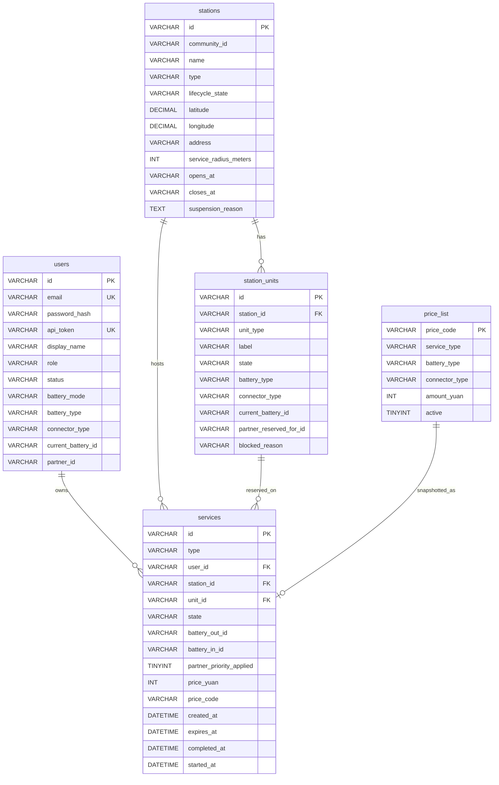

# Test Project Outline – Module C – SwapLoop REST API Backend

## Competition time

Competitors will have **3 hours** to complete this module.

## Introduction

SwapLoop is a fictional service for safer charging of electric bikes in Shanghai. It helps avoid charging e-bike batteries in apartments, corridors, or other unsuitable places — which previously led to serious fires.

SwapLoop stations offer:

- **Battery swap** for electric bikes with a compatible, removable battery.
- **E-bike charging bays** for electric bikes with a built-in battery.

Some stations provide only one of these services; hybrid stations provide both.

Riders register with an e-bike profile (swappable battery type or integrated connector type), then find a station by list, location, availability, or by scanning the station QR code. At the station they either **swap** a depleted compatible battery for a charged one, or **charge** a bike with a built-in battery in a charging bay. Each visit is a short reservation that the rider starts and completes on site; unfinished holds expire. The network bills **pay-as-you-go** per completed service.

The system distinguishes the following physical units:

- A **SwapLoop Station** is the full service location.
- An **E-bike Charging Bay** is used to charge a complete electric bike with a built-in battery.
- A **Battery Swap Cabinet** is the equipment that stores and charges swappable batteries.
- A **Battery Slot** is a single compartment in a Battery Swap Cabinet.

Currently, there are only two supported swappable battery types and two supported charging connector types for e-bikes with integrated batteries:

- Swappable battery types: `SL-48` and `SL-60`
- Charging connector types: `GB-AC-48` and `GB-AC-60`

In **Module C**, competitors build a **working prototype** of the **Main Backend**, a REST API consumed by the Module D SPA. Business logic for user registration, reservations, last-charge quarantine, live charging simulation orchestration, and pay-as-you-go pricing are implemented here.

In the overall architecture, there is a **Station Service**: a separate internal service that stands in for station / cabinet hardware and telemetry. **Station Service** simulates e-bike charging sessions and last completed charging-event telemetry for swappable battery packs. It is provided for this module, competitors do not need to implement it. Station Service APIs are **unprotected**, only to be called by the **Main Backend**.


## General Description of Project and Tasks

Implement the Main Backend with the described endpoints and business logic. The following is a high-level overview; detailed specifications are in the [Requirements](#requirements) section:

- implement authentication and authorization (opaque bearer tokens)
- implement consistent error handling
- list and filter available stations (list, filters, detail, compatibility, optional rider availability)
- implement unified services for swap and charging
- enforce last-charge safety via Station Service before swap reservation
- start Station Service charging bay sessions and expose their telemetry
- apply pay-as-you-go prices on confirm/collect and expose the price catalog

### Environment and provided assets

Build the API with a server-side language and framework available in the competition environment.

- Use **MySQL** for persistence. Import [`assets/db/swaploop_db.sql`](./assets/db/swaploop_db.sql).
- Implement the API according to [`assets/api/main-backend.openapi.yaml`](./assets/api/main-backend.openapi.yaml). That document is the contract for paths, requests, responses, security, and errors. Response and request schemas, response status codes and error codes must match the OpenAPI contract exactly. Offline Swagger UI: [`assets/api/main-backend-docs/index.html`](./assets/api/main-backend-docs/index.html).
- A Bruno / OpenCollection suite for the **Main Backend** is provided under [`assets/bruno/main-backend`](./assets/bruno/main-backend).
- Access the provided **Station Service** at `https://cXX-YYYY-station-service.sitc.skillsit.eu` (replace `cXX` / `YYYY` with your competition username and PIN). Its API is unprotected. See [`assets/api/station-service-openapi.yaml`](./assets/api/station-service-openapi.yaml), the offline Swagger UI at [`assets/api/station-service-docs/index.html`](./assets/api/station-service-docs/index.html), and the Station Service Bruno suite under [`assets/bruno/station-service`](./assets/bruno/station-service).
- **Database reset:** To reload the Module C MySQL seed (`assets/db/swaploop_db.sql`), call Station Service `POST https://cXX-YYYY-station-service.sitc.skillsit.eu/reset`. No authentication is required. Assessors and the provided Bruno suites use this endpoint the same way.

All Main Backend API paths in this document are relative to `/api/v1` on whatever host you run (for example `POST /auth/login` means `POST {baseUrl}/api/v1/auth/login`). Your deployed Main Backend is available at `https://cXX-YYYY-module-c.sitc.skillsit.eu` (replace `cXX` / `YYYY` with your competition username and PIN).

### Database structure

Use the provided database seed (`assets/db/swaploop_db.sql`) as-is. You do not need to change the schema of any table. The following diagram shows the tables of the database:



#### Table descriptions

| Table             | Description                                                                                        |
| ----------------- | -------------------------------------------------------------------------------------------------- |
| **users**         | Registered riders with their bike's details. SWAPPABLE riders track `current_battery_id`.          |
| **stations**      | Discoverable locations (`SWAP` / `CHARGING` / `HYBRID`) with state and location                    |
| **station_units** | `SWAP_BAY` (Battery Slot) or `BIKE_BAY` (E-bike Charging Bay) with state and compatibility fields. |
| **services**      | Single lifecycle row for swap or charging; price columns filled at finish.                         |
| **price_list**    | Pay-as-you-go prices for each service type (swap / charge), stored as whole yuan amounts.          |

### Technical constraints

- Return JSON for all normal and error responses.
- Use `Asia/Shanghai` as the business timezone. Return timestamps as ISO 8601 strings with an explicit offset.

## Requirements

The Main Backend shall implement the behaviours below. All routes, request bodies, responses, and errors must conform to [`assets/api/main-backend.openapi.yaml`](./assets/api/main-backend.openapi.yaml).

**Important:** Do **not** reimplement Station Service routes inside the Main Backend. Call the provided Station Service for last-charge telemetry and live bike-bay sessions as specified in [Battery safety via Station Service](#battery-safety-via-station-service) and [Live bike-bay charging via Station Service](#live-bike-bay-charging-via-station-service).

**Database:** Import [`assets/db/swaploop_db.sql`](./assets/db/swaploop_db.sql). Competitors must not change the seed identifiers required by assessment.

### Error Handling

Endpoints must return an appropriate HTTP status with a JSON object containing at least a machine-readable `code` and a human-readable `message`:

| Status | When to use                                                                               |
| ------ | ----------------------------------------------------------------------------------------- |
| `401`  | Missing or invalid authentication                                                         |
| `403`  | Suspended account, failed ownership, or forbidden action                                  |
| `404`  | Unknown resource where disclosure is safe                                                 |
| `409`  | Reservation collisions, invalid state transitions, active-service conflicts, unsafe packs |
| `422`  | Syntactically valid requests that fail validation or compatibility rules                  |
| `502`  | Upstream Station Service failure when fail-closed behaviour applies                       |
| `5xx`  | Unexpected server failures only                                                           |

Example:

```json
{
  "code": "CONFLICT",
  "message": "You already have an active service."
}
```

### Endpoints to be implemented on the Main Backend

#### General rules for the API

- Dynamic data must come from the database (and Station Service where specified).
- Placeholder parameters in the URL are marked with a preceding colon (e.g. `:stationId`).
- Property order in objects does not matter; array order matters where specified (e.g. nearest-first stations).
- `Content-Type` of JSON responses is `application/json`.
- Paths below are relative to `/api/v1`.
- Unless marked public, endpoints require a valid Bearer token.

---

#### Health

##### GET /health

Public liveness probe. No authentication required.

**Response:** `200 OK`

```json
{
  "status": "ok"
}
```

#### Authentication and authorization

The Main Backend uses **opaque** bearer tokens. Store each token in the `api_token` column of the `users` table (no sessions table, no JWT). Create tokens with a secure random generator.

1. `POST /auth/login` and `POST /auth/register` verify or create the user and return `{ "token": "..." }` only.
2. Clients send `Authorization: Bearer <token>` on protected routes.
3. On each protected request, look up the user whose `api_token` column matches that bearer token.
4. Missing or unknown token → `401 UNAUTHORIZED`.
5. Suspended accounts cannot log in and cannot call protected routes → `403 FORBIDDEN`.
6. Self-registration creates `RIDER` / `ACTIVE` only.

##### POST /auth/register

No authentication required. Creates a new account with bike details.

A user can register an account by providing the electric bike profile:

- `batteryMode`: `SWAPPABLE` and `batteryType`: `SL-48` \| `SL-60`, or
- `batteryMode`: `INTEGRATED` and `connectorType` `GB-AC-48` \| `GB-AC-60`.

Reject invalid mode/type combinations with `422`.
Reject duplicate email with `409 CONFLICT`.

Store the password as a bcrypt hash in `password_hash`. Return the new user's opaque `api_token`.

The created user's role is `RIDER` and status is `ACTIVE`.

The `voltageClass` (`48V` / `60V`) is derived from the selected type; it is not a separate field.

**Request example (swappable):**

```json
{
  "email": "new.rider@swaploop.test",
  "password": "password123",
  "displayName": "New Rider",
  "batteryMode": "SWAPPABLE",
  "batteryType": "SL-48"
}
```

**Request example (integrated):**

```json
{
  "email": "charge.rider@swaploop.test",
  "password": "password123",
  "displayName": "Charge Rider",
  "batteryMode": "INTEGRATED",
  "connectorType": "GB-AC-48"
}
```

**Response:** `201 Created`

```json
{
  "token": "sl_tok_rider-xxxxxxxx"
}
```

---

##### POST /auth/login

No authentication required. Verifies email + password against bcrypt `password_hash`. Store and return the user's opaque `api_token` on successful login. Suspended users cannot log in.

Seeded users:

| Bearer token       | Actor       | Name       | Email                      | Role    | Status      | Profile               |
| ------------------ | ----------- | ---------- | -------------------------- | ------- | ----------- | --------------------- |
| `sl_tok_rider-001` | `rider-001` | Lin Xiaoyu | `lin.xiaoyu@swaploop.test` | `RIDER` | `ACTIVE`    | SWAPPABLE / SL-48     |
| `sl_tok_rider-002` | `rider-002` | Chen Wei   | `chen.wei@swaploop.test`   | `RIDER` | `ACTIVE`    | INTEGRATED / GB-AC-48 |
| `sl_tok_rider-003` | `rider-003` | Zhao Min   | `zhao.min@swaploop.test`   | `RIDER` | `ACTIVE`    | SWAPPABLE / SL-48     |
| `sl_tok_rider-006` | `rider-006` | Sun Hao    | `sun.hao@swaploop.test`    | `RIDER` | `SUSPENDED` | INTEGRATED / GB-AC-60 |

Plaintext password for all seeded users: `password123`.

**Request example:**

```json
{
  "email": "lin.xiaoyu@swaploop.test",
  "password": "password123"
}
```

**Response:** `200 OK`

```json
{
  "token": "sl_tok_rider-001"
}
```

**Error responses (examples):** `401` (`UNAUTHORIZED`), `403` (`FORBIDDEN` for suspended), `422` (`VALIDATION_ERROR`).

---

#### Current rider

##### GET /me

Protected. Returns the authenticated user's public profile (no password or token must be returned in the response). Includes derived `voltageClass`.

**Response:** `200 OK`

```json
{
  "id": "rider-001",
  "email": "lin.xiaoyu@swaploop.test",
  "displayName": "Lin Xiaoyu",
  "role": "RIDER",
  "status": "ACTIVE",
  "batteryMode": "SWAPPABLE",
  "batteryType": "SL-48",
  "connectorType": null,
  "voltageClass": "48V",
  "currentBatteryId": "battery-101",
  "partnerId": null
}
```

**Error responses (examples):** `401` (`UNAUTHORIZED`), `403` (`FORBIDDEN`).

---

##### PATCH /me

Protected. Partial update of `displayName` and/or bike details ( `batteryMode`, `batteryType`, `connectorType`) with same validation rules as register endpoint.

**Response:** `200 OK` — updated public user object.

**Error responses (examples):** `422` (`VALIDATION_ERROR`), `401`, `403`.

---

##### GET /me/activity

Protected. Returns the rider's current and past activities.

- **`active`** — the current in-progress service, or `null` if none. Active means non-terminal states (`RESERVED`, `STARTED`, `CHARGING`, `READY_FOR_COLLECTION`). If the only candidate is `RESERVED` with `expiresAt` ≤ now, expire it first (service → `EXPIRED`; `SWAP_BAY`: `RESERVED` → `READY`; `BIKE_BAY`: `RESERVED` → `AVAILABLE`) and return `"active": null`.
- **`recent`** — show up to 5 of the rider’s past services in a terminal state (`CONFIRMED`, `COLLECTED`, `EXPIRED`, `CANCELLED`, `SAFETY_CUTOFF`), newest first (order by `completedAt`, then `expiresAt`, then `createdAt`).

**Response:** `200 OK`

```json
{
  "active": {
    "id": "service-ab12cd34",
    "type": "SWAP",
    "riderId": "rider-001",
    "stationId": "station-001",
    "unitId": "unit-001",
    "state": "RESERVED",
    "batteryOutId": "battery-001",
    "batteryInId": null,
    "priceYuan": null,
    "priceCode": null,
    "partnerPriorityApplied": false,
    "createdAt": "2026-08-15T12:00:00.000+08:00",
    "expiresAt": "2026-08-15T12:00:10.000+08:00",
    "startedAt": null,
    "completedAt": null,
    "timestamp": "2026-08-15T12:00:00.000+08:00"
  },
  "recent": [
    {
      "id": "service-9f81e2c0",
      "type": "SWAP",
      "riderId": "rider-001",
      "stationId": "station-002",
      "unitId": "unit-008",
      "state": "CONFIRMED",
      "batteryOutId": "battery-010",
      "batteryInId": "battery-101",
      "priceYuan": 5,
      "priceCode": "SWAP_SL-48",
      "partnerPriorityApplied": false,
      "createdAt": "2026-08-14T18:00:00.000+08:00",
      "expiresAt": "2026-08-14T18:00:10.000+08:00",
      "startedAt": "2026-08-14T18:00:02.000+08:00",
      "completedAt": "2026-08-14T18:00:05.000+08:00",
      "timestamp": "2026-08-14T18:00:05.000+08:00"
    }
  ]
}
```

When there is no active service and no history, return `"active": null` and `"recent": []`. Finished services include the `priceYuan` / `priceCode`.

---

#### Stations

##### GET /stations

List stations with optional filters. Sort nearest-first when `lat` / `lng` are provided; otherwise sort by `name`. Include `distanceMeters` when `lat` / `lng` are provided. Compute it with the Haversine formula in [`assets/handouts/handout-station-distance.md`](./assets/handouts/handout-station-distance.md).

No authentication required, but authenticated requests must also include `riderAvailability` for each station (see below).

**Query parameters:**

| Param           | Notes                                                                                                                                  |
| --------------- | -------------------------------------------------------------------------------------------------------------------------------------- |
| `lat`, `lng`    | Query coordinates (both required together). Each station in the response gets `distanceMeters`; sort nearest-first.                    |
| `radiusMeters`  | Query max distance in metres. Optional; default `1500` when `lat`/`lng` are present. Keep stations with `distanceMeters` ≤ this value. |
| `type`          | `SWAP` \| `CHARGING` \| `HYBRID`                                                                                                       |
| `service`       | `SWAP` \| `BIKE_BAY` — compatibility / availability filter                                                                             |
| `batteryType`   | With `service=SWAP`: `SL-48` \| `SL-60`                                                                                                |
| `connectorType` | With `service=BIKE_BAY`: `GB-AC-48` \| `GB-AC-60`                                                                                      |

Suspended stations remain discoverable in unfiltered lists but must not offer reservable capacity when `service` filters are applied.

**Response:** `200 OK`

Without `lat` / `lng`, omit `distanceMeters`:

```json
{
  "stations": [
    {
      "id": "station-001",
      "name": "Haitang Garden East Gate",
      "type": "HYBRID",
      "lifecycleState": "ACTIVE",
      "latitude": 31.2308,
      "longitude": 121.4717,
      "address": "88 Haitang Community Road",
      "compatibility": {
        "services": ["SWAP", "BIKE_BAY"],
        "batteryTypes": ["SL-48", "SL-60"],
        "connectorTypes": ["GB-AC-48"],
        "voltageClasses": ["48V", "60V"]
      }
    }
  ]
}
```

With `lat` / `lng` (for example `?lat=31.2308&lng=121.4717`), each station includes `distanceMeters` (whole metres). Stations outside `radiusMeters` are omitted:

```json
{
  "stations": [
    {
      "id": "station-001",
      "name": "Haitang Garden East Gate",
      "type": "HYBRID",
      "lifecycleState": "ACTIVE",
      "latitude": 31.2308,
      "longitude": 121.4717,
      "address": "88 Haitang Community Road",
      "compatibility": {
        "services": ["SWAP", "BIKE_BAY"],
        "batteryTypes": ["SL-48", "SL-60"],
        "connectorTypes": ["GB-AC-48"],
        "voltageClasses": ["48V", "60V"]
      },
      "distanceMeters": 0
    }
  ]
}
```

With bearer token, each station must also include `riderAvailability` computed for the authenticated rider:

```json
{
  "stations": [
    {
      "id": "station-001",
      "name": "Haitang Garden East Gate",
      "type": "HYBRID",
      "lifecycleState": "ACTIVE",
      "latitude": 31.2308,
      "longitude": 121.4717,
      "address": "88 Haitang Community Road",
      "compatibility": {
        "services": ["SWAP", "BIKE_BAY"],
        "batteryTypes": ["SL-48", "SL-60"],
        "connectorTypes": ["GB-AC-48"],
        "voltageClasses": ["48V", "60V"]
      },
      "riderAvailability": {
        "compatibleReadyBattery": true,
        "compatibleChargingBay": false
      }
    }
  ]
}
```

---

##### GET /stations/:stationId

Station details with compatibility.
No authentication required, but authenticated requests must also include `riderAvailability` for the station, with the same structure and logic as for listing stations.

**Response:** `200 OK` — station object as above (single resource, not wrapped in `stations`).

**Error responses (examples):** `404` (`NOT_FOUND`).

---

#### Services

The unified services (swap and charging) stored in one `services` row owns the full lifecycle (`type` `SWAP` \| `CHARGING` plus type-specific `state`).
Each service usage (swap or charging) is stored in the `services` table (type: `SWAP` or `CHARGING`) with type-specific current state.

**States for `SWAP`:** `RESERVED` → `STARTED` (`/start`) → `CONFIRMED` (`/confirm`). Cancel available from `RESERVED` or `STARTED`.
**States for `CHARGING`:** `RESERVED` → `CHARGING` (`/start`) → `READY_FOR_COLLECTION` (auto via `/charging-status`) → `COLLECTED` (`/collect`). Cancel only available from `RESERVED`.

Transitions are safe to retry: if a transition already succeeded, calling it again returns the current service and must not apply the change a second time.

##### POST /services

Protected. Creates a **10-second** reservation hold (`expiresAt` = now + **10 seconds**). (Note: The short period is for testing purposes, a real-world deployment would use a much longer hold, typically **15–30 minutes**.)

A rider may have only one active service at a time. Creating another service while one is still active returns `409`.

**Behaviour:**

- `SWAP`: rider must be `SWAPPABLE` as `batteryType`. Atomically reserve one `READY` matching `SWAP_BAY`. Before accepting a pack, evaluate last-charge telemetry (see **Battery safety via Station Service** below); quarantine/skip unsafe or `NO_TELEMETRY` packs and try the next candidate.
- `CHARGING`: rider must be `INTEGRATED` as `batteryType`. Atomically reserve one AVAILABLE matching `BIKE_BAY`.
- One active service per rider. Before enforcing that rule, expire any of the rider’s overdue `RESERVED` holds (`expiresAt` ≤ now → service `EXPIRED`; `SWAP_BAY`: `RESERVED` → `READY`; `BIKE_BAY`: `RESERVED` → `AVAILABLE`) so a timed-out hold does not block a new create.
- Set `expiresAt` to **now + 10 seconds** on the created service. (Later actions such as `POST /services/:serviceId/start` check `expiresAt`.)

**Battery safety via Station Service**

Before reserving a swappable pack, the Main Backend must call Station Service:

```http
GET {STATION_SERVICE}/api/batteries/{batteryId}/last-charging-telemetry
```

Station Service returns raw telemetry samples (`time`, `temperature`, `chargingVoltage`) of the battery's last charging session. **Quarantine decisions belong to the Main Backend.**

Refuse the pack (quarantine the bay / return `409 CONFLICT`) if **either** rule fails:

1. **Spike**: any sample has `temperature > 55`.
2. **Sustained heat**: a contiguous sample sequence where `time(last) − time(first) ≥ 5 minutes` and the arithmetic mean of those temperatures is `> 50`. A single hot reading alone does not satisfy Rule 2.

For a known battery with empty samples, Station Service returns `404 NO_TELEMETRY`. Do **not** treat that as healthy. Unsafe or `NO_TELEMETRY` packs must not be offered for swap.

Seeded fixtures:

| `batteryId`          | Station       | Expected outcome                |
| -------------------- | ------------- | ------------------------------- |
| `battery-001`        | `station-001` | Safe — reservation allowed      |
| `battery-005`        | `station-002` | Spike — quarantine / refuse     |
| `battery-007`        | `station-005` | Sustained — quarantine / refuse |
| `battery-002`, `003` | `station-001` | `NO_TELEMETRY` — refuse         |
| `battery-006`, `010` | `station-002` | `NO_TELEMETRY` — refuse         |

**Request example:**

```json
{
  "type": "SWAP",
  "stationId": "station-001"
}
```

**Response:** `201 Created` — Service object, for example:

```json
{
  "id": "service-ab12cd34",
  "type": "SWAP",
  "riderId": "rider-001",
  "stationId": "station-001",
  "unitId": "unit-001",
  "state": "RESERVED",
  "batteryOutId": "battery-001",
  "batteryInId": null,
  "priceYuan": null,
  "priceCode": null,
  "createdAt": "2026-08-15T12:00:00.000+08:00",
  "expiresAt": "2026-08-15T12:00:10.000+08:00",
  "startedAt": null,
  "completedAt": null
}
```

**Error responses (examples):** `422` (wrong vehicle profile), `409` (no capacity / no active service / all packs unsafe), `401`, `403`.

---

##### GET /services/:serviceId

Protected. Owner only may read the service.

**Response:** `200 OK` — Service object (see `POST /services`).

**Error responses (examples):** `404`, `403`, `401`.

---

##### POST /services/:serviceId/start

Protected, allowed only for the service's owner.

If the service is still `RESERVED` and `expiresAt` ≤ now: set the service to `EXPIRED`, return the unit (in the `station_units` table: `SWAP_BAY`: `RESERVED` → `READY`; `BIKE_BAY`: `RESERVED` → `AVAILABLE`), and return `409` (hold expired). An overdue hold cannot be started.

**SWAP:**
`RESERVED` → `STARTED` (simulated locker open). If the service is already `STARTED`, return it unchanged with `200` (do not fail and do not start again).

**CHARGING:**
When a rider starts a `CHARGING` service, the Main Backend must start a Station Service session calling `POST {STATION_SERVICE}/api/bike-bays/{unitId}/charging/sessions` using the service’s reserved `unitId`. On success, set the service `RESERVED` → `CHARGING` and record `startedAt`. If Station Service fails (network error, non-success status, or cannot create the session), leave the service `RESERVED`, do not change the bay, and return `502` or `409` as appropriate. If the service is already `CHARGING`, return it unchanged with `200` (do not start a second Station Service session).

**Response:** `200 OK` — updated Service.

**Error responses (examples):** `409` (expired hold or invalid state), `403`, `401`, `404`.

---

##### GET /services/:serviceId/charging-status

Protected. Owner only. For `CHARGING` services. Exposes live bike-bay charging telemetry.

**Behaviour:**

- Call Station Service `GET {STATION_SERVICE}/api/bike-bays/{unitId}/charging/sessions/current` using the service’s `unitId`.
- Return `{ service, charging }` where `charging` includes at least `status` (`CHARGING` \| `COMPLETED`), `startedAt`, `endsAt`, and `samples` (`socPercent`, `chargingPowerKw`, `temperature`) from Station Service.
- When Station Service reports `COMPLETED` and the service is still `CHARGING`, auto-transition the service (and unit) to `READY_FOR_COLLECTION` before responding.

**Response:** `200 OK`

```json
{
  "service": {
    "id": "service-ab12cd34",
    "type": "CHARGING",
    "state": "CHARGING"
  },
  "charging": {
    "status": "CHARGING",
    "startedAt": "2026-08-15T12:01:00.000+08:00",
    "endsAt": "2026-08-15T12:01:15.000+08:00",
    "samples": [
      {
        "socPercent": 42,
        "chargingPowerKw": 1.2,
        "temperature": 31.5
      }
    ]
  }
}
```

**Error responses (examples):** `409` (service not in a charging lifecycle state), `403`, `401`, `404`, `502` (Station Service unavailable).

---

##### POST /services/:serviceId/confirm

Protected. Owner only. Swap only. Move state `STARTED` → `CONFIRMED`.

On successful swap confirm, look up the matching active row in the `price_list` table from the rider’s `batteryType`, and in the same transaction copy the amounts into the service row’s `price_yuan` and `price_code` columns.

**Behaviour:**

- Bay goes `CHARGING` holding the rider’s previous pack (`batteryInId`); rider `currentBatteryId` becomes `batteryOutId`.
- Snapshot Pay As You Go (PAYG) `priceYuan` / `priceCode` from `price_list` (e.g. SL-48 → `5` / `SWAP_SL-48`).
- Confirm from `RESERVED` alone must fail (`409`).

**Response:** `200 OK` — Service with `state` `CONFIRMED`, `completedAt`, prices set.

---

##### POST /services/:serviceId/collect

Protected. Owner only. Charging: move state `READY_FOR_COLLECTION` → `COLLECTED`. Snapshot PAYG price; best-effort clear Station Service session; release bay to `AVAILABLE`.

On successful charging collect, look up the matching active row in the `price_list` table from the rider’s `connectorType`, and in the same transaction copy the amounts into the service row’s `price_yuan` and `price_code` columns.

**Response:** `200 OK` — Service with `state` `COLLECTED` and prices set (e.g. GB-AC-48 → `3` / `CHARGE_GB-AC-48`).

---

##### POST /services/:serviceId/cancel

Protected. Owner only.

- If the service is still `RESERVED` and `expiresAt` ≤ now: set the service to `EXPIRED`, return the unit (`SWAP_BAY`: `RESERVED` → `READY`; `BIKE_BAY`: `RESERVED` → `AVAILABLE`), and return `409` (already expired — nothing left to cancel).
- Swap: cancel from `RESERVED` or `STARTED`.
- Charging: cancel only from `RESERVED`.

**Response:** `200 OK` — Service with `state` `CANCELLED` and `completedAt`.

**Error responses (examples):** `409` (expired hold or invalid state), `403`, `401`, `404`.

---

#### Price list

##### GET /price-list

Public catalog of active PAYG rates. Receipts still use snapshotted service fields at finish.

**Response:** `200 OK`

```json
{
  "currency": "CNY",
  "items": [
    {
      "priceCode": "SWAP_SL-48",
      "serviceType": "SWAP",
      "batteryType": "SL-48",
      "connectorType": null,
      "amountYuan": 5
    },
    {
      "priceCode": "SWAP_SL-60",
      "serviceType": "SWAP",
      "batteryType": "SL-60",
      "connectorType": null,
      "amountYuan": 7
    },
    {
      "priceCode": "CHARGE_GB-AC-48",
      "serviceType": "CHARGING",
      "batteryType": null,
      "connectorType": "GB-AC-48",
      "amountYuan": 3
    },
    {
      "priceCode": "CHARGE_GB-AC-60",
      "serviceType": "CHARGING",
      "batteryType": null,
      "connectorType": "GB-AC-60",
      "amountYuan": 4
    }
  ]
}
```

---

#### Batteries (safety helper)

##### POST /batteries/:batteryId/evaluate-last-charge

Protected optional helper for debugging. Fetches Station Service last-charge telemetry and returns the Main Backend evaluation outcome (`SAFE`, `QUARANTINED` with reason, or telemetry errors). Swap reservation must still enforce the same rules inline.

**Response:** `200 OK` example:

```json
{
  "batteryId": "battery-001",
  "outcome": "SAFE",
  "unitId": "unit-001"
}
```

**Error responses (examples):** `404` (`NO_TELEMETRY` / not found).

---

## Assessment

Module C will be assessed using automated HTTP tools (including the provided Bruno suite) against the competitor Main Backend. The following aspects will be evaluated:

- **Endpoint correctness:** responses match the specified structure, HTTP status codes, and JSON field names in the OpenAPI contract
- **Error handling:** correct status codes and error codes for defined scenarios (`401`, `403`, `404`, `409`, `422`, `502` where applicable)
- **Authentication:** opaque bearer tokens; suspended accounts rejected
- **Atomic holds:** concurrent requests cannot reserve the same bay or pack
- **Swap safety:** spike / sustained / `NO_TELEMETRY` packs are not reserved; seeded fixtures behave as specified
- **Swap lifecycle:** start → confirm inventory exchange; cancel rules; confirm-without-start rejected
- **Charging lifecycle:** fail-closed start; live `/charging-status` telemetry proxy + auto ready; collect + price snapshot
- **PAYG:** confirm/collect snapshot correct `priceYuan` / `priceCode`; `GET /price-list` returns the catalog
- **API documentation compliance:** endpoints adhere to [`assets/api/main-backend.openapi.yaml`](./assets/api/main-backend.openapi.yaml)

Database restore for assessment uses Station Service `POST /reset`.

## Mark distribution

The mark distribution for this project is as follows:

| WSOS SECTION | Description                            | Points |
| ------------ | -------------------------------------- | ------ |
| 1            | Work organization and self-management  | 1.5    |
| 2            | Communication and interpersonal skills | 1.5    |
| 3            | Design Implementation                  | 0      |
| 4            | Front-End Development                  | 0      |
| 5            | Back-End Development                   | 14     |
| **Total**    |                                        | 17     |

Final criterion-level marks live in [`marking/marking-scheme.json`](./marking/marking-scheme.json).
