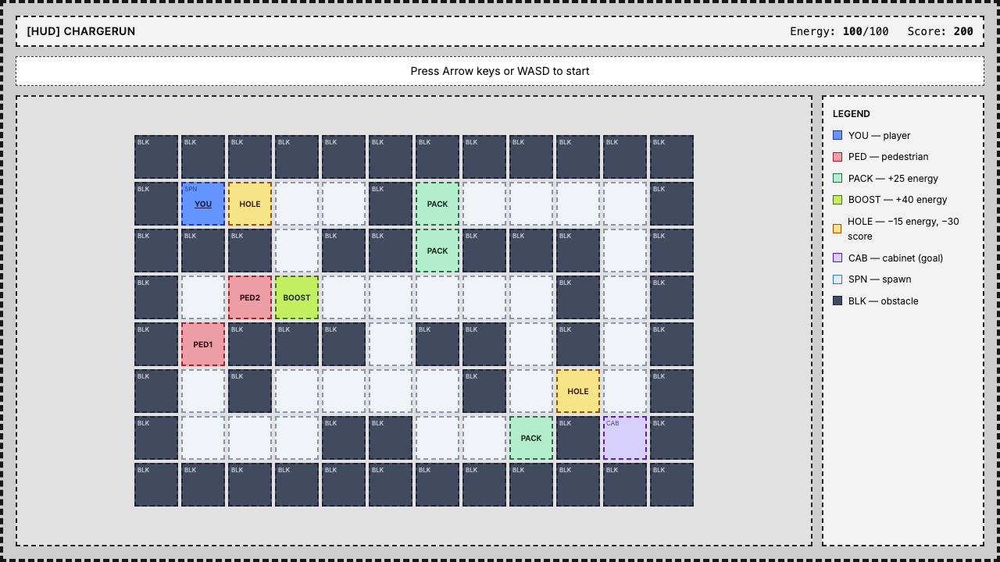
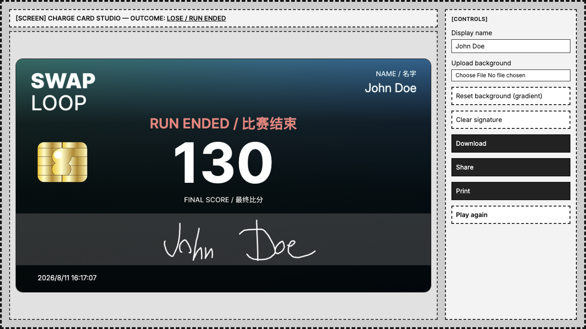

# Test Project Outline – Module E – SwapLoop ChargeRun Interactive Frontend App

## Competition time

Competitors will have **3 hours** to complete this module.

## Introduction

SwapLoop is a fictional Shanghai community pilot exploring safer alternatives to charging e-bike batteries indoors. Compatible delivery and private e-bikes exchange removable batteries at swap stations; e-bikes with integrated batteries use monitored charging bays; delivery partners can receive controlled priority access; and operators and safety inspectors manage sites, assets, and incidents.

Each **SwapLoop Station** includes a touchscreen kiosk next to the battery swap cabinet. While riders wait for a fresh battery pack or a monitored bay to open, the kiosk offers a short branded minigame.

**ChargeRun** is that kiosk experience! The player steers an e-bike, collects energy packs, avoids pedestrians and potholes, and tries to reach the Battery Swap Cabinet before energy runs out. A successful run mirrors what SwapLoop asks of real riders: arrive at the station powered, not stranded.

When a run ends with a **win**, the kiosk opens the **Charge Card** studio directly. On a **lose**, show a brief toast or overlay first (see [Win / lose](#win--lose)), then open the studio. The studio is a canvas editor where the player builds a personal score card (background photo, SwapLoop frame, score text, and signature). The card can be downloaded, shared, or sent to the station printer. Collecting Charge Cards is part of the pilot's community engagement: riders keep them as souvenirs, and can redeem them for promotional swap credits at participating stations. 🔋

The application you build must run **independently**. It must **not** call a backend API, Station Service, or rider-facing REST endpoints. All behaviour is client-side, using the supplied card assets and the rules in this brief.

## General Description of Project and Tasks

Implement an independently runnable single-page application presented as a **fixed-size horizontal kiosk**.

There are **exactly two screens**:

1. **Game** - ChargeRun (DOM/CSS/JS), keyboard-controlled.
2. **Charge Card studio** - canvas compositor with upload, signature, download, share, and print.

High-level capabilities (details in [Requirements](#requirements)):

- Fixed **1280×720** px kiosk shell (not responsive) - align the kiosk in the center of the screen
- ChargeRun grid game with per-run randomization, energy, packs, potholes, pedestrians, cabinet goal, and scoring
- Charge Card studio: background (file input + drag-and-drop), dynamic text, signature, download, share, print
- `localStorage` for display name
- Use Shanghai timezone and Chinese date format when formatting any visible date/time on the Charge Card.
- Installable / downloadable web app from Chrome. You only have to provide the minimum configuration to make the APP installable. Logos can be found under the `assets/module-e/logos` folder.
- Target the latest **Google Chrome** for assessment.
- Use the provided `Inter` font wherever possible

### Vocabulary

| Term                     | Meaning                                           |
| ------------------------ | ------------------------------------------------- |
| **SwapLoop**             | Platform brand                                    |
| **ChargeRun**            | Name of this kiosk mini-game                      |
| **Charge Card**          | Personal achievement image created after a run    |
| **Battery Swap Cabinet** | Goal cell - reach it with energy remaining to win |
| **Energy pack**          | Collectible that restores energy                  |
| **Pothole**              | One-time cell that costs energy and score points  |
| **Pedestrian**           | Moving obstacle - collision loses the run         |

### Suggested time split

| Block | Focus                  | Approx. time |
| ----- | ---------------------- | ------------ |
| A     | Kiosk shell, ChargeRun | ~1.5 hours   |
| B     | Charge Card studio     | ~1.5 hours   |

### Design and wireframes

The competitor should design a **kiosk-like** ChargeRun screen with a modern, game-like feel. Only the **Inter** font is provided. Colors, layout details, and visual style are up to the competitor. Wireframes and the example video are **functional references only** (required items and behaviour). They show structure, not the look to copy; the wireframe design itself must not be reproduced.

Functional references:

- Game screen wireframe: [`assets/module-e/wireframes/1-game-screen.png`](./assets/module-e/wireframes/1-game-screen.png)
- Charge Card studio wireframe: [`assets/module-e/wireframes/2-charge-card-studio-screen.png`](./assets/module-e/wireframes/2-charge-card-studio-screen.png)
- Example behaviour video: [`assets/module-e/wireframes/video-example.mov`](./assets/module-e/wireframes/video-example.mov)





Game objects - the e-bike, energy packs, boost pack, potholes, pedestrians, cabinet, and terrain - should be **creative CSS shapes** built with DOM/CSS (gradients, shadows, glow, pseudo-elements, subtle animation). Plain coloured boxes with text labels are not enough. Each item must be **instantly distinguishable** by shape and styling, not colour alone.

The HUD, the Legend, and the Charge Card studio should share one coherent SwapLoop style.

## Requirements

### Kiosk shell and navigation

1. Provide a fixed horizontal kiosk stage of exactly **1280×720** pixels. Centre it on the page.
2. Only two screens exist, both INSIDE the kiosk: **Game** and **Charge Card studio**.
3. SPA navigation between those two screens without a full browser reload.
4. On app load, open the **Game** screen directly (no start menu).
5. From the Charge Card studio, provide a **Play again** control that returns to the Game screen and starts a **new** run setup (re-roll randomization, frozen until the first move key).
6. Pass the completed run’s outcome (`WIN` \| `LOSE`) and final score into the card studio.

### ChargeRun (game)

Build the game described here.

#### Story and goal

The player controls an e-bike on a small city grid. Energy drains over time. Collect energy packs to stay powered. Avoid pedestrians and potholes. Reach the **Battery Swap Cabinet** with energy remaining to win.

#### Run states

| State     | Behaviour                                                                                                                                                                                                                  |
| --------- | -------------------------------------------------------------------------------------------------------------------------------------------------------------------------------------------------------------------------- |
| `READY`   | Grid is set up and visible. Player is on spawn. Energy drain and pedestrians are **frozen**. Show hint: `Press Arrow keys or WASD to start`.                                                                               |
| `RUNNING` | Entered on the **first** valid movement key (`ArrowUp` / `ArrowDown` / `ArrowLeft` / `ArrowRight` / `W` / `A` / `S` / `D`). That same key also moves the player one cell. Energy drain and pedestrian movement are active. |

There is **no** Start button. Opening the Game screen always leaves the run in `READY` until the first movement key.

#### Grid (fixed structure)

1. Build a rectangular grid of **DOM cells**.
2. A hardcoded grid is provided in [`assets/module-e/layout.js`](./assets/module-e/layout.js) (`BASE_LAYOUT`).
3. Distinguish cell types visually (by color, border, label or texture).

#### Per-run randomization

Every time a run is set up (app load, and every **Play again**), roll a **new** configuration:

1. **Energy packs (4):** randomly choose **4 distinct `ROAD` cells** that are not `SPAWN` and not `CABINET`. Place one energy pack on each. Among those four, randomly mark **exactly 1** as a **boost pack** (`+40` energy instead of `+25`).
2. **Potholes (2):** randomly choose **2 distinct `ROAD` cells** that are not `SPAWN`, not `CABINET`, and not occupied by an energy pack. Place one pothole on each.
3. **Pedestrian routes (2):** a hard-coded catalogue of pedestrian paths is provided in [`assets/module-e/layout.js`](./assets/module-e/layout.js) (`PEDESTRIAN_PATH_CATALOGUE`; each path is an ordered list of `ROAD` coordinates). For each run, randomly assign **2 different** paths from that catalogue to the two pedestrians. Randomly choose each pedestrian’s starting index on their path and whether they begin moving forward or backward along the path.
4. After rolling, render the grid and place the player on `SPAWN` in `READY`.

#### Player movement

1. The player moves **one cell per key press** while `RUNNING` (and the first press also transitions `READY` → `RUNNING`).
2. Required movement keys (all must work):

| Key          | Move  |
| ------------ | ----- |
| `ArrowUp`    | Up    |
| `ArrowDown`  | Down  |
| `ArrowLeft`  | Left  |
| `ArrowRight` | Right |
| `W`          | Up    |
| `S`          | Down  |
| `A`          | Left  |
| `D`          | Right |

3. Ignore moves into `OBSTACLE` cells and off the grid.

#### Energy

| Rule               | Value                                                                                |
| ------------------ | ------------------------------------------------------------------------------------ |
| Starting energy    | `100`                                                                                |
| Maximum energy     | `100`                                                                                |
| Drain              | `15` energy points every **1 second** while `RUNNING`                                |
| Normal energy pack | Entering its cell: `+25` energy (clamp to 100); remove the pack                      |
| Boost energy pack  | Entering its cell: `+40` energy (clamp to 100); remove the pack                      |
| Pothole            | Entering its cell: `−25` energy (clamp to 0); then remove the pothole from that cell |
| Energy reaches `0` | Immediate `LOSE`                                                                     |

Energy does **not** drain in `READY`.

#### Pedestrians

1. Exactly **2** pedestrians, each on its randomly assigned path.
2. Move each pedestrian one step every **600 ms** while `RUNNING` only (frozen in `READY`).
3. When a pedestrian reaches either end of its path, reverse direction (ping-pong).
4. If the player and a pedestrian occupy the **same cell** → immediate `LOSE`.

#### Win / lose

| Outcome | Condition                                                       |
| ------- | --------------------------------------------------------------- |
| `WIN`   | Player enters the `CABINET` cell with energy greater than 0     |
| `LOSE`  | Energy reaches 0, **or** player shares a cell with a pedestrian |

**On `WIN`:** navigate to the **Charge Card studio** immediately.

**On `LOSE`:** the run **pauses** and the game shows a **toast or overlay** for a few seconds that explains **why** the run ended. Energy drain, pedestrian movement, and player input must be frozen while it is visible. Use a message that matches the cause.

After the toast or overlay dismisses (or its timer elapses), navigate to the **Charge Card studio**.

#### HUD

While on the Game screen, show continuously:

- current **energy**
- current **score**
- run state hint when `READY` (`Press Arrow keys or WASD to start`)

#### Scoring

Use integer arithmetic; clamp the final score at a minimum of `0`:

```text
score =
    (normalPacksCollected * 100)
  + (boostPackCollected * 150)
  + (remainingEnergy * 2)
  + timeBonus
  - collisionPenalty
  - potholePenalty
```

| Term                   | Definition                                                                                                   |
| ---------------------- | ------------------------------------------------------------------------------------------------------------ |
| `normalPacksCollected` | Number of normal (`+25`) packs picked up                                                                     |
| `boostPackCollected`   | `1` if the boost pack was collected, else `0`                                                                |
| `remainingEnergy`      | Energy when the run ends                                                                                     |
| `timeBonus`            | On `WIN` only: `max(0, 60 - elapsedWholeSeconds) * 5`. On `LOSE`: `0`. Timer starts when entering `RUNNING`. |
| `collisionPenalty`     | `200` if the run ended by pedestrian collision; otherwise `0`                                                |
| `potholePenalty`       | `30` per pothole triggered during the run                                                                    |

Update the live score when packs or potholes change; finalise on run end.

#### `localStorage`

1. Display name (string).
2. In the Charge Card studio, prefill the display name input from `localStorage` when a saved name exists.

### Charge Card studio

Opened when the game ends - immediately on `WIN`, or after the lose toast/overlay on `LOSE`. The Charge Card is a **personal score certificate** for that run: a single landscape image that combines a photo background, SwapLoop branding, the player’s name and score, and a handwritten signature. It is meant to be kept (download), sent to someone (share), or printed at the kiosk.

Compose the card on an HTML `<canvas>` inside the kiosk.

**Card size:** **960×540** pixels (landscape). The downloaded PNG must be 960×540.

The preview should have `16px` border radius.

#### What appears on the card

From bottom to top:

1. **Background photo** - photo behind everything. The player can replace it. If no background is uploaded, a blue-green gradient should be displayed instead.
2. **Brand overlay** - the supplied transparent PNG (`/assets/module-e/charge-cards/charge-card-overlay.png`) drawn at full card size. This provides the SwapLoop frame / logo art; do not redraw that art yourself.
3. **Dynamic text** drawn with canvas text APIs at the positions below:
   - **Name** - player display name
     - Font: 28px, regular
     - Right-aligned: the right edge of the text sits at x=927, y=55
   - **Outcome** - exactly `SAFE ARRIVAL / 平安抵达` (with color #91FF89) on win, or exactly `RUN ENDED / 比赛结束` (with color #FF8989) on lose
     - Font: 32px, semi bold
     - x: centered, y: 135
   - **Score** - the numeric final score, large and prominent
     - Font: 128px, bold
     - x: centered, y: 185
   - **Date** - the current date/time formatted with timezone `Asia/Shanghai (zh-CN)`
     - Font: 16px, regular
     - x: 50, y: 500
     - Date format example: 2026/8/7 10:46:42
4. **Signature** - ink strokes the player draws in the signature box.
   - x: 0, y: 358
   - width: 960, height: 120

Use fill color `#FFFFFF` for text. Signature stroke color `#FFFFFF`, line width `3`. Load and use the webfonts from [`assets/module-e/fonts/`](./assets/module-e/fonts/) for canvas text.

The `x` and `y` are the coordinates of the top-left corner, unless specified otherwise.

You can find an example of the charge card in the `assets/module-e/charge-cards` folder.

#### Studio UI (DOM controls beside or below the canvas, still inside the kiosk)

| Control           | Behaviour                                                           |
| ----------------- | ------------------------------------------------------------------- |
| Display name      | Text input; required for Download, Share, and Print; Stored locally |
| Upload background | File input                                                          |
| Reset background  | Restore the gradient                                                |
| Clear signature   | Wipe signature strokes                                              |
| Download          | Save composited PNG as `chargerun-charge-card.png`                  |
| Share             | Web Share API with the PNG file                                     |
| Print             | Send the Charge Card to the printer                                 |
| Play again        | Return to Game; set up a new randomised run in `READY`              |

#### Display name

1. Trim whitespace.
2. If empty, block Download, Share, and Print and show a visible field error.
3. Prefill from `localStorage` when set.
4. Persist the trimmed name when Download, Share, or Print is successfully initiated.

#### Background upload (file input + drag and drop)

1. Provide a visible **file input** (or a button that opens one) accepting `image/jpeg`, `image/png`, and `image/webp`.
2. Dropping a file onto the **kiosk** must run the **same** validation and apply pipeline as the file input, therefore uploading the background with drag-and-drop also works.
3. Reject other MIME types with a visible message.
4. Reject files whose **file size exceeds 5 MB** with a visible message.
5. Only accept background images with the same size as the card (960×540)
6. Draw accepted images onto the card

#### Signature pad

1. Draw with mouse on the card canvas (touch support is not required for now)
2. Clip all strokes to the signature box - no marks outside the box.
3. **Clear signature** removes all strokes.
4. If empty, block Download, Share, and Print and show: `Please sign inside the box`.

#### Download, Share, Print

1. **Download:** (PNG) → file download named `chargerun-charge-card.png`.
2. **Share:** use the Web Share API with a PNG `File`. Title/text: `SwapLoop ChargeRun`.
3. **Print:** open the browser print dialog so the Charge Card can be printed. Print the card image. Do not print the entire kiosk.
4. Do not upload the image to a custom server.

Game visuals (player, pedestrians, packs, potholes, cabinet, obstacles) are built by the competitor with **creative DOM/CSS** - see [Design and wireframes](#design-and-wireframes). Each object must be visually distinct; simple coloured boxes with text labels are not sufficient.

## Assessment

Assessed in the latest Google Chrome by manual testing and expert review. Observable behaviour matters more than framework choice.

## Mark distribution

| WSOS SECTION | Description                            | Points |
| ------------ | -------------------------------------- | ------ |
| 1            | Work organization and self-management  | 1.75   |
| 2            | Communication and interpersonal skills | 1.1    |
| 3            | Design Implementation                  | 4.05   |
| 4            | Front-End Development                  | 9.1    |
| **Total**    |                                        | **16** |

This is a client-only module, so Section 5 (Back-End Development) is not used. Section 4 is larger than the usual band because ChargeRun rules and the Charge Card studio are front-end behaviour. Exact aspects are in [`marking/marking-scheme.json`](./marking/marking-scheme.json).
